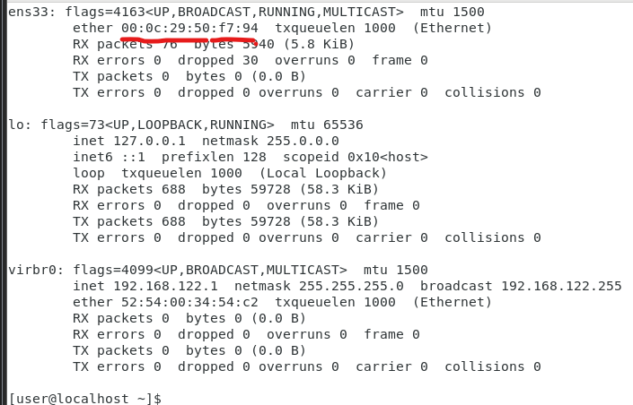
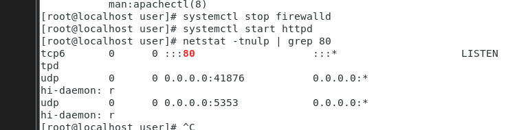
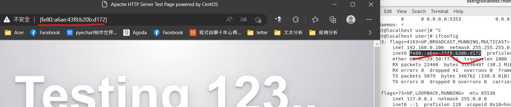

# First Lesson

## cluster(集群)
避免服務器端**掛掉**，產生逆向心理，要讓伺服器有一顆強大的心臟，使得消費者**重拾信心**。

### Server farm
有很多的server，使得容錯性強，掛一台不代表全掛，其他的還能跑，Performance提升

### 目標為針對集群進行安裝
如果要安裝100多台不就瘋掉?所以需要使用一些特殊的方法進行安裝  
## 以下為本課程目標
1. 安裝
2. 運作
3. 維護
4. 監控(多台監控)
---
### 有沒有辦法結合Line來提醒使用者?
---
## 普羅米修斯(監控軟件)
1. 可以用來管理集群
2. Docker
3. k8s

### 本課程重點
要交筆記(***必須要使用網頁的方式來呈現***)
可以提出一些老師沒有教的東西上台來報告。
(e.g. 腳本程式設計)

### 十七週或第九週希望我們能夠重現上課的內容

---
Ansible是什麼?  
 
---
### 相關工作
1. SRE工程師
2. DevOps工程師
   
---
   
##### 利用網路上的資源學習新穎的資訊不用局限於課本(但我想我晚上會失眠...)
可能盡量不要在晚上用電腦
~~還是得看書~~

怎麼架設有憑證的網站(但是有效期限只有三個月)

如果會使用腳本的話，每三個月就讓它自動更新憑證?!!

Hacker很喜歡更換你的首頁?...
不行怎麼可以這麼丟臉...

有在職場上學到新的工具可以提供給老師，交流學習內容。

- 快取伺服器?
  >就像是暫存與硬碟之間的關係?

- 架設伺服器要多少錢
- 伺服器怎麼跟網頁做結合?
- 伺服器怎麼跟你的app做結合?
  
---
## 怎麼使用Linux來搞錢?

---
為了避免公司的資料被我誤刪(~~故意?~~)
所以需要jumpserver

會根據不同的身分點給不同的權限。(~~它一定給我最低的權限...~~)

# 本節課重點  
## 架設ipv6網站
[Ipv6_testLink]
(https://test-ipv6.com/index.html.zh_TW)
(第一張照片)
測試是否能連上ipv6


### VM setting


Enter ```ifconfig```



接著啟動伺服器(可能要先關閉防火牆)

#### 假如沒有安裝httpd要先安裝
使用yum之前要使用su來更換成管理員

```
su
then set your admintor password
```
```
yum install httpd
```

## 先關閉防火牆
```
systemctl stop firewalld
```

#### 檢查httpd狀態及開啟httpd
```
檢查httpd狀態
systemctl status httpd 
開啟httpd
systemctl start httpd　
```

```
檢查httpd是否開啟
netstat -tnulp | grep 80
```
*顯然我們是開啟了ww*


then
將你的ipv6位置加上[]就可以在瀏覽器當中顯示你剛剛架設的網站了
(第二張照片)


#### 現在架的網站全世界就可以連接的到!!

### Dynv6.com
註冊後就會跳轉到這個頁面，


到你的虛擬機 輸入ifconfig就可以看到你的ipv6位置(記得要打開網路!!)

點擊Create Zone
  

導航欄的My zone可以看到你剛剛創建的 Zone
  

>這邊提醒一下各位如果你必須先去gmail驗證一下你的身份(它會寄驗證信)
才能夠使用Domain name的功能，否則你試10000遍都沒用(不說了，說了都是淚= =)

需要先啟動httpd與停止firewall
  

你的網站能夠使用Domain Name在公網上給別人瀏覽了~
  


