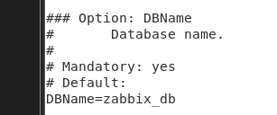
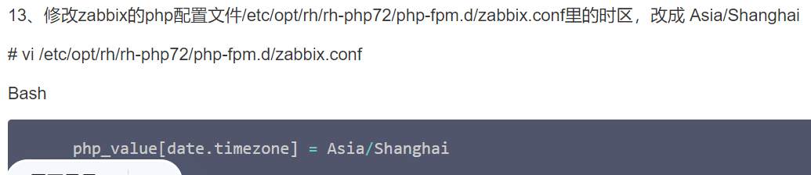
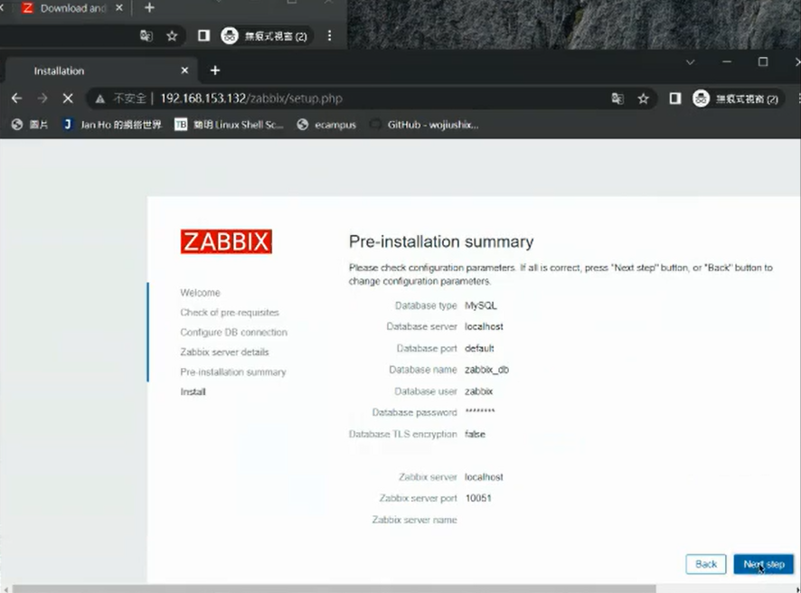
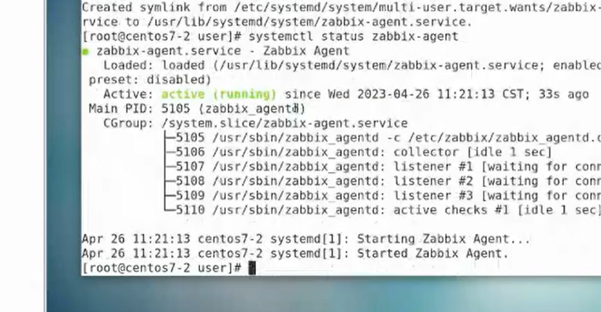

監控軟體
就不用手動查看機器有沒有出現問題了
server/client/proxy

client收集系統資訊
loading /Hardware status...
active/passive

passive -> monitor定期詢問

proxy(分公司)


  
proxy 代理人負責回報分公司資訊給Server monitor?

事件發生傳送email或Line
透過email信箱傳送信到其他信箱
## 發送email

> https://security.google.com/settings/security/apppasswords?pli=1
> 先產生密鑰

```
vi /etc/mail.rc

set smtp-use-starttls
set ssl-verify=ignore
set nss-config-dir=/etc/pki/nssdb/
#設定寄件者信箱
set from=smallko@gmail.com
 (http://from=smallko@gmail.com/)#設定Gmail_Smtp端口
set smtp=smtp://smtp.gmail.com:587
#設定Gmail_Smtp認證帳號
set smtp-auth-user=xxxx@gmail.com
 (http://smtp-auth-user=smallko@gmail.com/)#設定Gmail_Smtp認證帳號之密碼(請使用Google應用程式密碼)
set smtp-auth-password=xxxxxx
set smtp-auth=login
```

```
set smtp-use-starttls
set ssl-verify=ignore
set nss-config-dir=/etc/pki/nssdb/
#設定寄件者信箱
set from=s110910537@student.nqu.edu.tw
#設定Gmail_Smtp端口
set smtp=smtp://smtp.gmail.com:587
#設定Gmail_Smtp認證帳號
set smtp-auth-user=s110910537@student.nqu.edu.tw
#設定Gmail_Smtp認證帳號之密碼(請使用Google應用程式密碼)
set smtp-auth-password=jwksupbflyffvhum
set smtp-auth=login
```

  
紅色部分要更改
 

``` echo 內容 | mail -v -s "標題" 收信者email
```

  
> 貌似是發送出去了

---

```
[root@localhost Dockerfile]# setenforce 0
```
關閉selinux與 firewalld

照著教學做
> https://cloud.tencent.com/developer/article/1943154

沒有epel-release就要安裝
```
yum install epel-release
```
官方Zabbix5.0安裝教學
>https://www.zabbix.com/download?zabbix=5.0&os_distribution=centos&os_version=7&components=agent&db=&ws=

  

資料庫密碼好像是password

  

  

  


 #mysql -uroot -p

Bash
```
create database zabbix_db character set utf8 collate utf8_bin;
create user zabbix@localhost identified by 'password';
grant all privileges on zabbix_db.* to zabbix@localhost;
quit;
```

```
zcat /usr/share/doc/zabbix-server-mysql*/create.sql.gz | mysql -uzabbix -p zabbix_db
```

可以連接資料庫後於Windows下載軟體
  

  

  

他有告訴你怎麼安裝
為甚麼有時候需要yum clean all?

伺服器軟體與客戶端軟體都會安裝在同一台機器上

## 我覺得好像我裝到5.0以上的zabbix才會發生錯誤...

我重裝zabbox5.0根著做就好了
  

  

  

## 沒有Zabbix server資料....
原來是沒有安裝到，因此重新yum install zabbix_server

  

  
>把前面的#弄掉加上名稱(zabbix_db)

  


加上
  

修改時區

找不到zabbix.conf...
# 原來是我剛剛 
  

# 沒有改到!!
  

## 修改完後再重第六步重新開始...
  

  

訪問Zabbix
  


```
systemctl restart zabbix-server zabbix-agent httpd rh-php72-php-fpm
systemctl enable zabbix-server zabbix-agent httpd rh-php72-php-fpm
```
## ifconfig 得到ip位置 (需要安裝httpd)
  


```
systemctl restart zabbix-server

systemctl start rh-php72-php-fpm
systemctl enable rh-php72-php-fpm
```
## 重啟httpd
```
systemctl restart httpd
```

## 我一直重啟它還是不讓我開啟Zabbix服務!!!
後來發現是我的配置檔沒有設定好  
> 居然有兩個DBName...
> 難怪開不起來

## 還是不能連....
  
> 發現可能是我防火牆沒關

  
> 終於進來了 = =

## 時區沒有設定好?
  

  
> 好像是這裡被動了手腳!! ...

## 再次重啟..
```
systemctl restart zabbix-server zabbix-agent httpd rh-php72-php-fpm
```
## 它好了!!
  


Zabbix可以做甚麼?

  


## 登不進去..
  

### 原來是我沒有按照它的原始設定~

## 終於進入到管理介面
  
> 截一張圖上傳telegram (完成)


  
> 進入管理畫面

## 新的教學檔
> https://t.me/nqucsie2023linux3/787
> 跟著做

  
> 兩台都要安裝

配置agent_conf

修改成自己的Server位置
  

ServerActive也要修改成自己的Ip位置 #要拿掉

HostName = centos7-2 (主機的名稱-根據你的主機而定)

7-2 與 7-3的配置檔都要修改

接著重新啟動agent
並設置enable
就是跟著教學做...

> https://computingforgeeks.com/install-and-configure-zabbix-agent-on-centos/

  
> Agent 是7-2的ip

  

  
> 就會出現centos 7-2 欄位是預設的監控項

繼續配置centos7-3 
但這樣不還是手動配置嗎?....有沒有自動化的方式


  

  
> 做到這兩顆燈會亮起

手工測試

> 詢問主機一些相關資訊

## Zabbix安裝
  
> 不要使用最新的版本，除非你要開發

  


  

  

  
> 修改伺服器的配置檔

  
> 修改為zabbix_db

  
> 自己加上密碼

  
> 修改時區指令

  
> 修改時區

  
>  重新啟動

  
> 就可以進入Zabbix介面

## 安裝看官方步驟  指令的部分看centos7 安裝 Zabbix5.0系列

```zabbix安裝做到官網的step C,接著做https://cloud.tencent.com/developer/article/1943154 步驟11
```

  
> 要記得更改配置檔

  

  
> next step

  
> 檢查是否都ok沒有問題執行下一步

  
> 設置資料庫名稱與密碼

  
> 確認資訊

  
> 配置成功

  
> Admin  password:zabbix

  
> 就可以進入到管理介面 (截一張作業圖)

## 伺服器已經架設好了 現在要來架設客戶端

> https://t.me/nqucsie2023linux3/


> https://computingforgeeks.com/install-and-configure-zabbix-agent-on-centos/

  
> 回應伺服器分為主動即被動模式

客戶端是安裝在centos7-2與7-3上

台灣人被後藤新平看輕貪財愛錢愛面子

### Add Zabbix 5.0 repositories using the commands below:
```
 sudo yum install https://repo.zabbix.com/zabbix/5.0/rhel/7/x86_64/zabbix-release-5.0-1.el7.noarch.rpm
```
> 兩台客戶端都安裝 **Zabbix-agent and sender**

  

### Configuring Zabbix

  

  
> Client的Config Server change to Server's ip address(take off #)
> Server 也改成這樣
> 防火牆與SELINUX記得要關

  
> Hostname change to your own hostname (client)
> another client end do the same thing

  
> let it can automatic start with open the machine

  
> Take care of the Zabbix's status 

  
> Check the firewalld setting

  


  
> Check the Zabbix's agent status (Upload the image to telegram)


  
> Setting config file from web

  
> setting the client's configuration

  
> Setting the templeate ,Because the templeate already had a lot of presetting for us

## Then click the update

### Countinue setting centos7-3

  
> complete setting for centos7-2 and centos7-3 (Upload this image to telegram)

# 終於完成!!
  


已經製作: EMAIL 與 MYSQL

