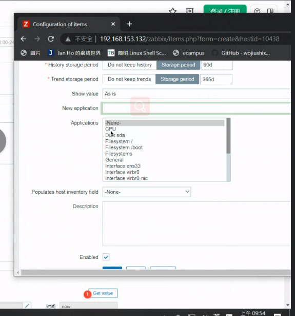
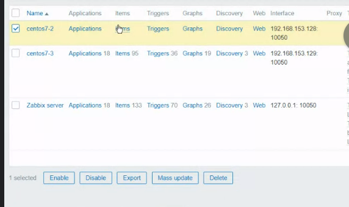
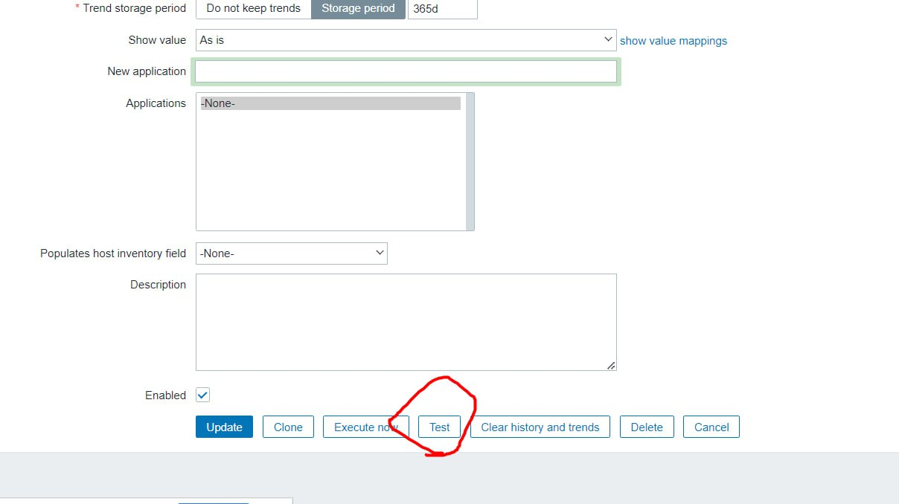
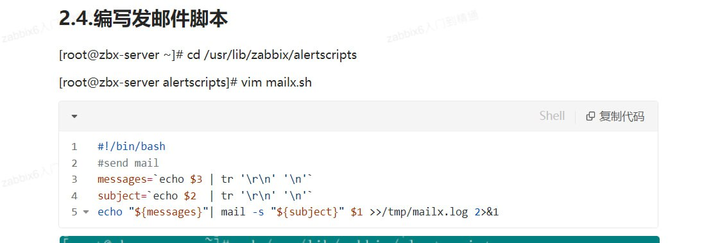
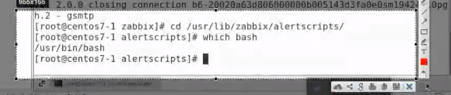
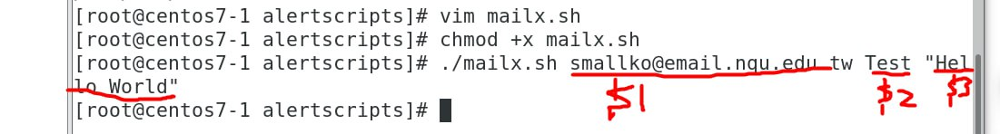
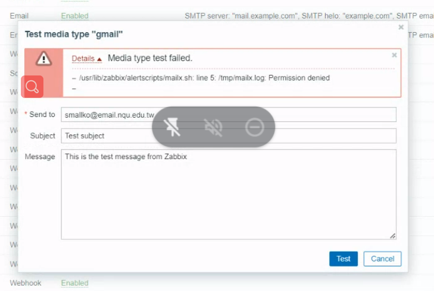
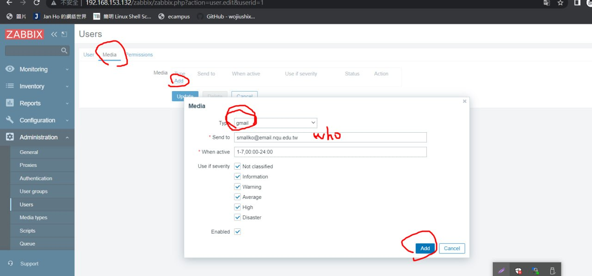

# zabbix
自動幫你分類


  

application是大分類
  

item是細向

receive與sent都有統計
  

Trigger可以觸發通知,ex: cpu overload

Graphs可以繪圖
  

  

Monitor -> hosts 可以看到主機
  

Graph有描述
  

  
傳送資料

zabbix會顯示有傳送流量趨勢圖

反映時間沒有這麼快(有一定的延遲)

  
就是可以監控主機的一些使用事項

創造自己監控的item?
> https://www.yuque.com/fenghuo-tbnd9/ffmkvs/pspogt
> 參考這個網站

  
選擇 configuration -> host -> centos7-2(你的主機) -> item
就可以create item，現在我們要創建一個item是關於cpu的使用率

  

## 安裝zabbix-get
```
yum install zabbix-get
```
  
> server 與被監控端的關係

  

  
> 獲取cpu閒置時間(手動)
但在zabbix可以使用自動的方式來達成

  
zabbix有提供一些標準的格式你可以直接複製

  

Units 代表符號
Update interval是多久回報一次(太快伺服器會很忙)

  

生產線可能會設置30s 或 60s
  
> 可以做分類

  
> 先把模板拿掉才能加入自己的設置?

還是不行就先刪除主機再加入



  

  


  


  

  
> chose Javascript

  

  

  

  
> 就可以得到使用率 (抓這張使用率的圖)

## Triggers
  

  
> 測試用，寫5% 工作可能會寫80%

  

  
> 他會自動幫你產生公式?

  

 
  


  
> 提出的警告強度 Warring(可以自己選)
> 你的expression一定要設定正確不然之後不能發送郵件你會找到瘋掉!!!

  
> Trigger添加完畢

  
> 創建一個隨機變數 並進行雜湊加密
> cpu使用率升高 超過5% Problems的cpu utilization rate就開始飆升 (需要截一張圖)

  

  
> 可以看到CPU使用率

  
>程式終止時就可以看到CPU utilization有明顯下降

  
> (抓一下這張圖)

**zabbix可以設定有狀況就可以發email或Line 的通知**

  
> add與 update要按下去

## 安裝mail 工具
```
yum -y install postfix cyrus-sasl-plain mailx
```

  
> 先測試是不是可以發送email

> https://www.yuque.com/fenghuo-tbnd9/ffmkvs/mempmphi0ozeckdf
> 教學文件

  
> 要做以上內容

  
> bash位置可能不同

  
> 裡面的內容

  

  
> 就可以收到信了

  
> 修改權限

  


  

  

  
> 腳本可能有問題

  
> 修改了剛剛的檔案

  
> Media types 是: 要你提供哪些資訊

  

  

## 關聯

  

  

  
> 記得按下Update不然會找很久找不到錯誤喔!


  

  

  


  

  

  

  
> 事件觸發 發送gmail

  
> 停止運作

  
> 危機解除，發送信件。


