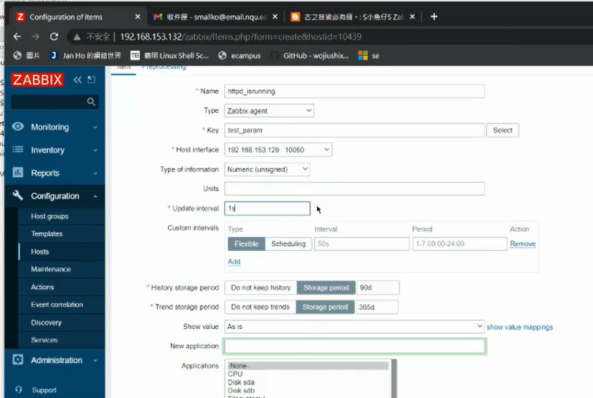

## Line 通知增加即時性

## 增加Zabbix 功能(額外自增項)

> https://t.me/nqucsie2023linux3/905
> 教學文章

先登入Line

  
> 點擊個人頁面

  
> 發行權杖

  


  

  

  

  
> 把它儲存起來

  
> 切換到zabbix腳本目錄

  

```
#!/bin/bash
# LINE Notify Token - Media > "Send to".
TOKEN="$1"

# {ALERT.SUBJECT}
subject="$2"

# {ALERT.MESSAGE}
message="$3"

curl https://notify-api.line.me/api/notify -H "Authorization: Bearer ${TOKEN}" -F "message=${message}"
```
> 貼上此段代碼

  
## TOKEN修改成你剛剛得到的權杖
  
### SUBJECT改成`$1` MESSAGE改成`$2`
儲存退出

登入Line
  
> 變成可執行檔

  
> 設置權限

```
sudo chmod 755 /usr/lib/zabbix/alertscripts/line_notify.sh
sudo chown zabbix:zabbix line_notify.sh
```

### 需要把Line Notify邀請到你的群組
  


### 輸入以下指令
  
> 發送到Line端

  
> 抓一張傳送成功的圖

  
> 其實剛剛那個腳本檔subject用不到可以標注起來
message改成`$1`

  


  

  
> 到zabbix端創建一個新的media type

  
> message`$1`與zabbix欄位做對應

  
> 新增了Line notify欄位


  
> 好像要按admin

  
> 有些人的畫面是這樣，就要按ADMIN


  

  
## 記得按下Update喔不然不會保存

  
> 換配置action

  

## 還要設定Operation

  

  

 


> 最後opration 設置像這樣
  

### recover opration

  

  


  
> 點擊add

  


### 下圖為設定成功知畫面
  

### 再次進行壓力測試~
  
> 在centos7-2上面打開(錯誤方式)

  
>正確方式

  
> Message template好像也要設定

  
> 點LineNotify

  
> 點Message templates

  
> 點Add再點Message template的Add

### problem recover
**再次點Add這次出現的就是problem recover**
  

一樣添加上去
### update
  
最後按下Update上傳模板就完成了~


  
> 就會在Line上面通知你

  
> 接者是centos7-3的部分
```
cd /etc/zabbix
```
修改zabbix_agentd.conf

  
> 這張圖少了conf....


  
> 關鍵的點

UserParameter是由兩個部分所構成的test_param是監控項的名稱 curl 127 ....是監控的內容

curl 127.0.0.1判斷httpd是否有啟動

  
> 0代表httpd run
>非0值代表沒啟動
 
  
> restart

  
>如果無法使用zabbix_get 則要yum install

  
> -s後面 的ip位置是centos7-3的ip位置 傳回非0值代表httpd沒有開啟
>  centos7-3 的httpd開啟與沒有開啟的情況(貼一下這張圖)
```
UserParameter=test_param,curl 127.0.0.1> /dev/null 2>&1; if [ "$?" -eq "0" ]; then echo "1"; else echo "0"; fi
```
> conf檔案當中可以加入這一行以顯示有多少使用者連線

  
> 可以透過ssh連接到7-3

  
> centos7-3 可以查看有多少人連線

  
> 可以在zabbix上面配置 我們自製的監控項

  
> 這張比較清楚

  
> 斷開連線monitor也會顯示

好像是網頁伺服器啟動它會上升關閉會下降 就是關於test_params的那一段

我本來不能顯示但修改了
  

加上了空格，再重啟zabbix centos7-1與7-3
他神奇地又好了


## 需要上傳一段httpd開與關的結果與畫面

有時會有這種情形
  

不知道重新啟動會不會有效果?


## 計算共幾個人連接到我們的httpd Server
  

```
UserParameter=connections, netstat -an | grep "ESTABLISHED" | wc -l
UserParameter=ssh_connections, netstat -an | grep 22 | grep ESTABLISHED | wc -l
```


### 進行簡單的測試
  

  
> 目前建立了兩條連線(centos7-2 -> centos7-3)

  
> 添加監控項

  

  
> 點擊下方Add

  

## Step 1.
  


 

  
## Warning記得要選，因為我們之前發送Line與email的機制是達到warning及以上會發送

### Step 1.
  
按下select 選擇item


  
> 找到我們剛剛創建的ssh_connections


  
> 設置成這樣

按下insert

  

  
> 上傳一張圖
## 以上為編寫zabbix沒有提供的腳本

