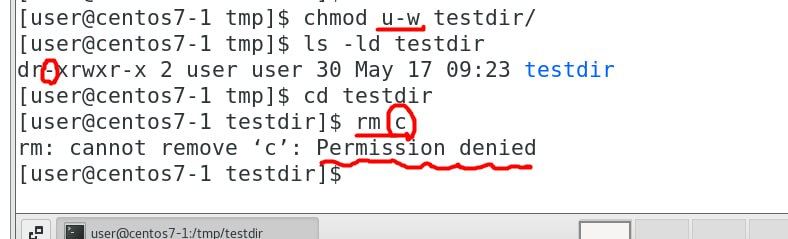

需要開三台虛擬機

高級linux管理設定

> https://blog.gtwang.org/linux/how-to-make-file-immutable-on-linux-chattr-command/

  

  

  

變成超級使用者就可以刪除所有的資料

`理論上想要讓所有用戶不能夠刪除檔案，但root可以刪除`

如果root誤刪就會很危險，為此，有一種高級的屬性

  
現在是所有的屬性都沒有被開啟

  
> 今天要說的是a 鎖與 i 鎖
> 
  
> 為a file add i lock

  
> 現在root 也不能隨意突破這個防護網了

  

  

  

## ACL Linux細部權限

> https://ithelp.ithome.com.tw/articles/10221185

可以設定個別權限
ex: tom 的內容 mary可以看，但不能編輯

學習東西之前要了解為甚麼要學這個?(另一種視角)

Access Control le

  

> add user

  

  

  

  
> mary can edit

  

  
> mask 可以防止權限被誤開　假如mask只有 rw 有人開啟rwx 則 x會被忽略掉

## setfacl error
  

不知道甚麼原因.... 我cd..又進到testdir裡面他又好了
  

資安用英文名字 
ciso
CFO -> 財政長?
聽不懂就去查
機台要怎麼管理與維護

資安會迅速發展
傳統機台會遭受攻擊
調參網路化就可能被攻擊?

需要使用網路來統計
工業4.0
快時尚,需要推出大量不同的產品，產品是小量的，才能夠提供各種人的需求。

水果庫存夠不夠，產線預測及評估。

雖然連網可能是使用內部網路

IT 進入 OT
內網不是實際封閉的，找到突破點就能夠進入內網，就能夠攻擊內部網路。

攤位介紹怎麼進入資安的產業，怎麼進去好的公司?

所有產業都一樣，怎麼讓這些公司看到你，碩士班或者求職都依樣，要怎麼讓他們看到你，資安有對應的研討會活動之類的...把關於資安的成果發布於研討會，技術文件與報告

寫的一些程式最好放到github上

怎麼寫技術報告

如果沒有經濟上的壓力，最好考上一個好的研究所。

(給的錢不是很高XD)

要選對行業，
小主管運維7-8萬
別人工作一個月等於你工作兩個月

不要三心二意

## 設置好主機的名字
產生密鑰
  

  

  
> 編輯一下host位置

  

繼續?
  

好像是傳送金鑰到centos7-2(他還會要你輸入密碼)
  

  
> 貼一張圖

  
> 安裝ansible

  

  
> server1 -> centos7-2
> server2 -> centos7-3

  
> 可以個別創建或群體創建(以利於個別操作)

可以使用ip或domain name
甚至是範圍

  
> 抓一張圖

  
> 指令有被執行檔案有變動會變黃色，沒有更改是綠色

  

  

  
> command只適合比較簡單的指令，使用管道可能會發生錯誤

### 解決的方式
使用shell

  

  

  

