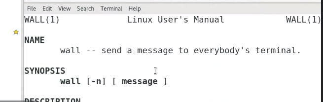
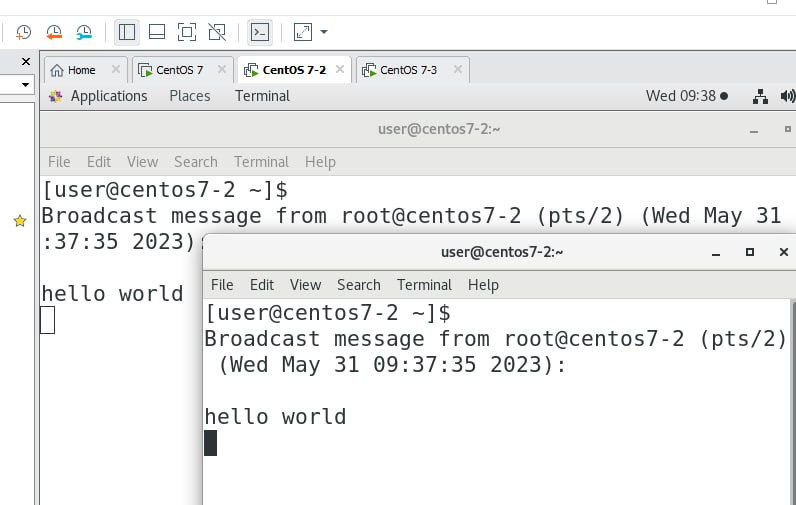
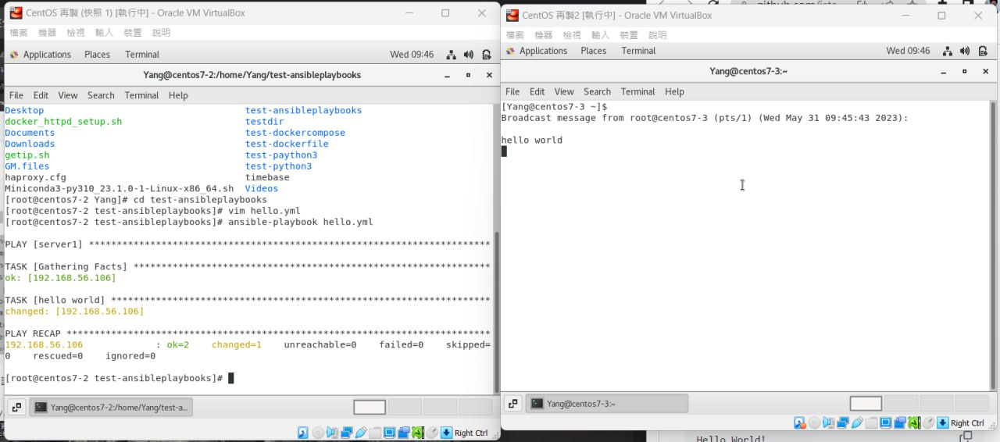
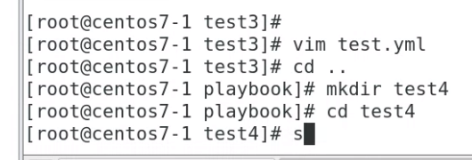
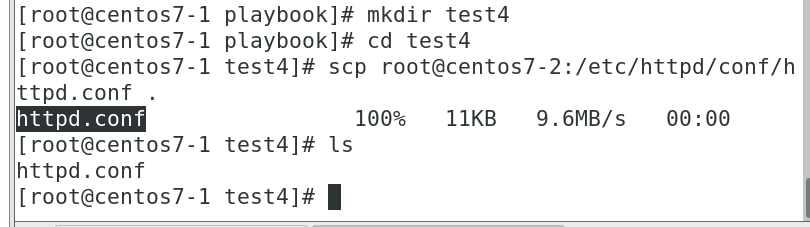
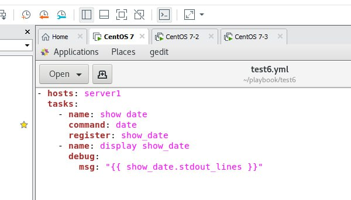
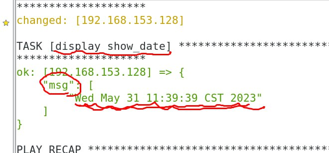
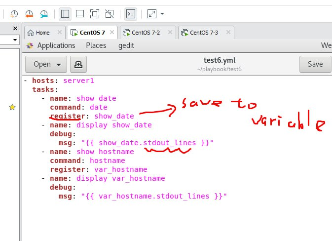

這次提供的是學長的筆記
> https://github.com/istar0me/linux-note/blob/107-2/Ansible.md#ansible-playbooks

YAML 格式
```
- hosts: servers
  remote_user: root  
  
  tasks: #執行哪些工作
    - name: hello world #工作的名稱
      command: /usr/bin/wall helloworld #工作的內容
```  
Wall 的作用

  
> 提醒用戶要關機了趕快儲存資料?

縮牌要用空格鍵而不是tab鍵

抓一下下方這張圖
  

- 原本要輸入這行指令：`ansible app2 -m command -a '/usr/bin/wall hello world'`
- 現在可直接使用腳本：`ansible-playbook -C hello.yml`

### Part2 Generator website

add `a.html` html content:

```
Hello World!
```
edit `test.yml`

```
---
- hosts: app2
  remote_user: root
  tasks:
    - name: create new file
      file: name=/tmp/newfile state=touch
    - name: create new user
      user: name=test2 system=yes shell=/sbin/nologin
    - name: install package # 安裝 httpd 套件
      yum: name=httpd
    - name: copy html # 將檔案複製到 app2 的指定資料夾
      copy: src=a.html dest=/var/www/html
    - name: start service # 啟動 httpd 服務
      service: name=httpd state=started

```

- In client side getting test:

```
curl 192.168.56.104/a.html
```

## Take a picture like:

  


## Part3 

```
---
- hosts: server1
  remote_user: root
  tasks:
    - name: show date
      command: date
    - name: run a shell script
      shell: /usr/bin/somecommand || /bin/true
    - name: show hostname
      command: hostname

```

may take 
```
ansible-playbook -C test.yml
```

Everytime you need create a folder
  

### Part4
Create test4 folder

First you need passing centos1's httpd.conf to test4 folder

Passing Manager control client end

  

change test4's conf port number like 80->8888

save and close

using script for transform to another clinet

test4.yml
``` 
---
- hosts: servers
  remote_user: root
  tasks:
    - name: install httpd
      yum: name=httpd state=installed
    - name: copy html
      copy: src=httpd.conf dest=/etc/httpd/conf
      notify: restarted httped
    - name: start httpd
      service: name=httpd state=started
  handlers:
    - name: restarted httpd
      service: name=httpd state=restarted

```
Then in terminal type:
`ansible-playbook -C test4.yml`

It well rewrite httpd port number if client doesn't install httpd it will help you.


  

  

  
