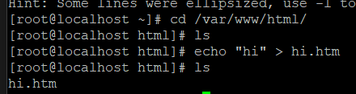
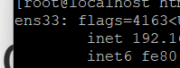
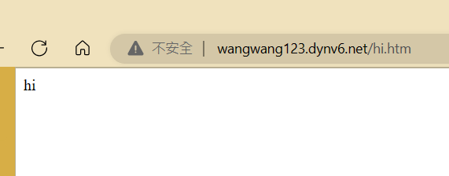
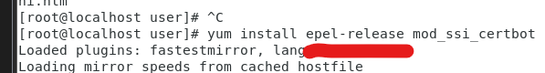
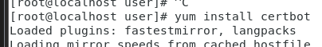
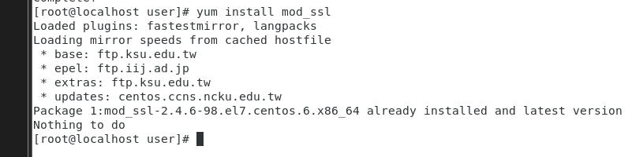
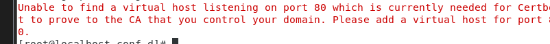
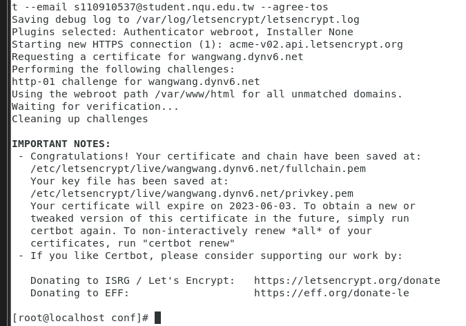
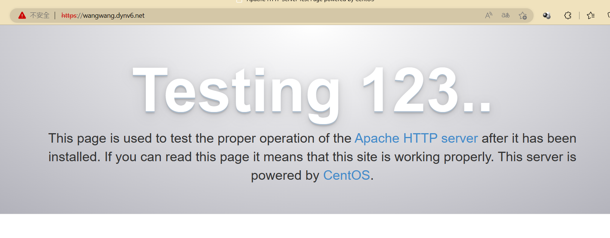

連接自Ipv6的網路(使用手機分享)

到/var/www/html資料夾創建一個叫做hi.htm 之後網站就可以顯示你輸入的內容，這邊我們輸入的內容是: hi

  

  

找到inet6 複製它的Ip位置貼到dynv6上面
  

輸入你剛剛設定的Domain Name及/hi.htm就可以看到你剛剛echo的頁面

安裝epel的模組
  

安裝certbot
  


申請憑證
```
certbot certonly --webroot -w /var/www/html -d wangwang123.dynv6.net --email s110910537@student.nqu.edu.tw --agree-tos
```

錯誤...不能用
>https://www.snel.com/support/install-lets-encrypt-centos-7/
參考這個網站

VPS?

```
yum install epel-release mod_ssl
```

```
yum install python-certbot-apache
```
The requested apache plugin does not appear to be installed

yum install 一直try other mirror

重新輸入
yum clean all
yum makecache
yum update

重新安裝
  

顯示已經安裝了...看了ceean all確實有作用

繼續參考senl這個網站
>https://www.snel.com/support/install-lets-encrypt-centos-7/
參考這個網站

執行step 2
```
yum install python-certbot-apache
```

也可以，剛剛果然yum壞掉了...
```
certbot --apache -d example.com
```
example.com是你的DomainName
也就是dvny6上面你設定的名字(可自行更改成你上面的名字)

***注意要切回你的手機網路不然IP跟dnv6上面設定的不一樣，它會找不到***


>Unable to find a virtual host listening on port 80 which is currently needed for Certbot to prove to the CA that you control your domain. Please add a virtual host for port 80.

... 又遇到錯誤
我發現ipv4 也要在 dnv6裡面輸入不然他會找不到網址

他一直叫我要更改host
  

```
cd /etc/httpd/conf.d
sudo nano yourDomainName.conf
```
>到httpd/conf.d下創建你的DomainName.conf

```
<VirtualHost *:80>
    ServerName yourDomainName.com
    DocumentRoot /var/www/html
    ServerAlias www.yourDomainName.com
    ErrorLog /var/www/error.log
    CustomLog /var/www/requests.log combined
</VirtualHost>
```
>yourDomainName是dynv6上面設定的DomainName
假如我在上面叫做 www123456.dynv6.net
我在這邊就要輸入www123456.dynv6.net.com

nano編輯器我不會用改用vim..

```
systemctl restart httpd
```
重新啟動httpd

找了很久打算不找了= =
直接輸入學姐的指令
```
certbot certonly --webroot -w /var/www/html -d christinatest.dynv6.net --email s110810505@student.nqu.edu.tw --agree-tos
```
當然 -d --email有改


  

居然就成功了?花了四五個小時...

雖然是可以進入，但怎麼顯示不安全...
  
