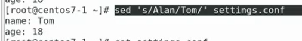

WebDav

使用https會比較安全
虛擬機要坐鏡像
安裝第三方庫
>yum install epel-release

安裝httpd

測試是否有支援WebDav
  
  

  

建立資料夾
  

更改權限
  

編輯webdav.conf
  


```
DavLockDB /var/www/html/DavLock
<VirtualHost *:80>
    ServerAdmin webmaster@localhost
    DocumentRoot /var/www/html/webdav/
    ErrorLog /var/log/httpd/error.log
    CustomLog /var/log/httpd/access.log combined
    Alias /webdav /var/www/html/webdav
    <Directory /var/www/html/webdav>
        DAV On
        #AuthType Basic
        #AuthName "webdav"
        #AuthUserFile /etc/httpd/.htpasswd
        #Require valid-user
        </Directory>
</VirtualHost>
```

重新啟動
```
systemctl restart httpd
```

於WebDav建立a,b,c,d 文件
```
touch {a..d}
```

  

  
> 作業圖片

新增網路磁碟機
  

  

貼上你的位置

  
> 無法創建資料....
>

  

```
cat <<EOF >settings.conf
> name: Alan
> age: 18
> EOF
```
> 創建一個settings.conf檔案

  
> 作業圖片

  
> 全部取代 settings.conf是檔案

  
> only show on the screen

  
> 加上i 就會改掉裡面的內容

  
> 把abc d 改成 a bcd
> 作業圖片


