影片產生字幕
> https://github.com/smallko/test-whisper
> 老師的程式

1. 產生字幕檔用影片
2. 產生字幕用URL
3. 產生英文字幕用URL


Voice chatGPT
可以練習英文對話喔~

**跟他說一個假設的場景就可以跟他對話了**

DNS Server

>把DNS轉換成實際的IP位置

bind -> DNS Server

每台電腦都有ip位置很難記憶所以需要Domain Name 但實際上還是IP 因此需要**Dns Server**

DNS查詢

FQDN(完整網域名稱)
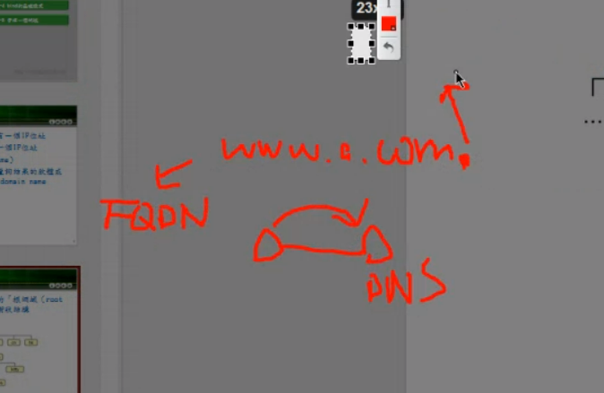  

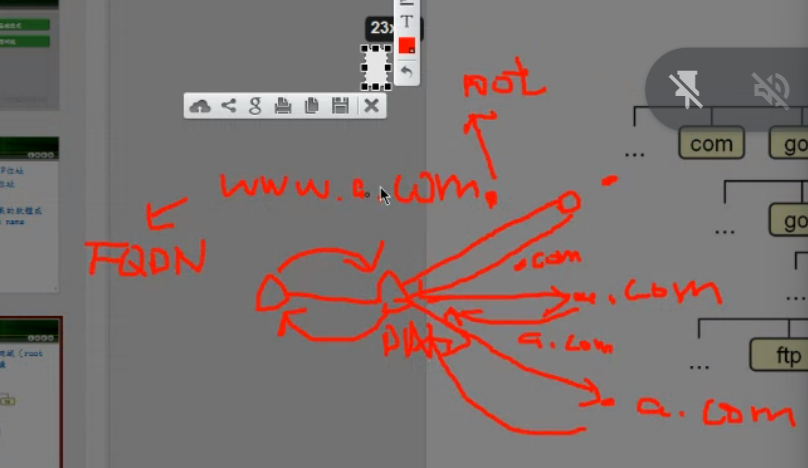  

ip位置很難記憶所以才需要Domain Name，但是**真正的傳輸**還需要IP

DNS 就像是一個簡單的資料庫 *domain name + ip 對應*

A紀錄
一個a > ipv4
四個a > ipv6

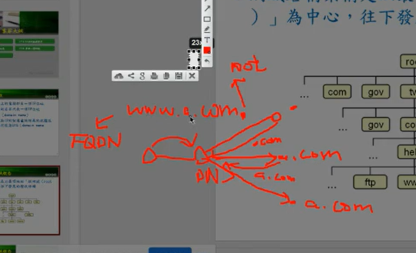  
> DNS 的查詢

其他紀錄類型
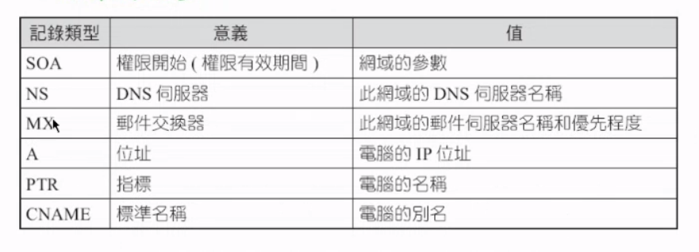  

根網域
特殊網域需要申請


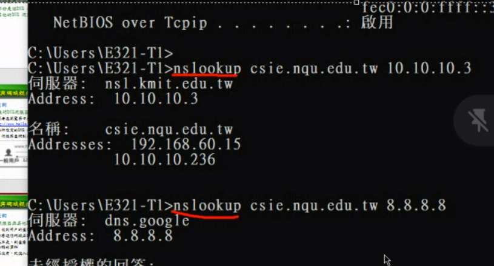  
>nslookup 可以查詢Domain name 與 IP 的轉換

FQDN 是Domain name 最後要加上一點
ex. www.baidu.com.

建立Domain name server就是在建立Domain name 與 IP的對應

13台根網域伺服器

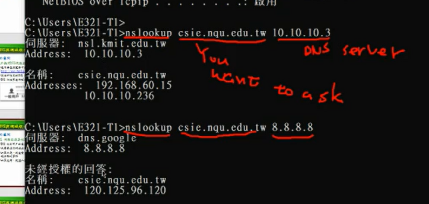  
>DNS Server給出不一樣的答案

10.10.10.3是NQU的DNS Server

google(8.8.8.8)沒有管我們的DNS 所以會出現未經授權的回答

Linux名稱查詢工具
dig
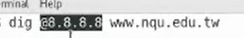  
> 查看別的dns位置的回應

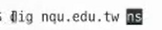  
> 管理nqu.edu.tw的 dns server是誰 是這段話的意思

## host
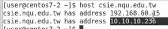  
> 內網與外網的ip


## 伺服器架設
### 安裝bind

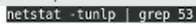  
> 查看伺服器是否有被使用

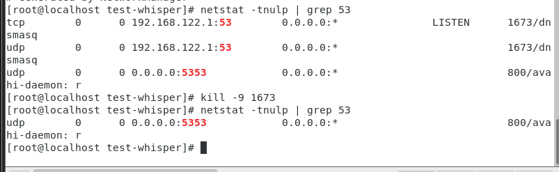  
> 先確保53 port沒有人使用 現在有人使用所以我把它砍掉了

### 安裝bind

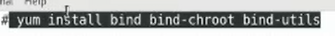  
>安裝 bind bind-chroot bind-utils

### 更改配置檔
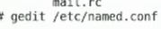  

**原本的設定**
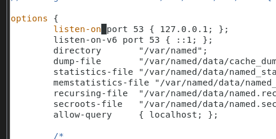  

**更改後的設定**
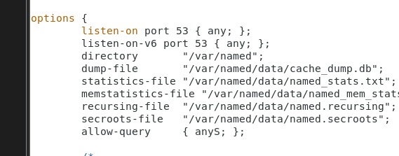  
> 改成any讓其他機器也能查詢到
> allow-query 裡面沒有S 我輸入錯誤
> 按esc 輸入:wq 保存退出

### 重啟named
systemctl restart named

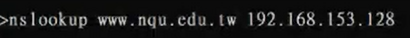  
> 作業要做好像要學校網路

### 管理網域
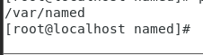  
> 移動到named資料夾


```vi a.com.zone```
貼上以下內容 email內容要進行更改那是管理者的email
``` code
$TTL 600 ;10 minutes

@ IN SOA	@ ramy1231863.gmail.com (
		2021031803 ;serial
		10800      ;refresh
		900        ;retry
		604800     ;expire
		86400      ;minimum
		)
@		NS    dns1.a.com.
dns.com.	A     192.168.56.108
dns1		A     192.168.56.108
www		A     192.168.56.150
eshop		CNAME www
ftp		A     192.168.56.150
abc		A     192.168.56.120
```

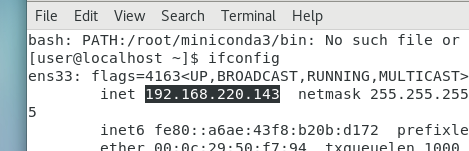  
>我的網域是220

所以進行了以下的更改
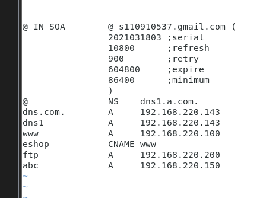  
> dns.com. 與dns1跟自己的ip位置一樣
> www ftp abc根據自己的網域來調整

編輯此檔案
```vi /etc/named.rfc1912.zones```
在最後的位置增加以下代碼:
```
zone "a.com" IN {
	type master;
	file "a.com.zone";
	allow-update { none; };
};
```

```
named-checkconf
```
> 檢查配置檔

zone "56.168.192.in-addr.arpa" IN {
	type master;
	file "56.168.192.in-addr.arpa.zone";
	allow-update { none; };
};
> 56改成你的網域 我改成 220.168.192

複製56.168.192.in-addr.arpa.zone
編輯 vi /var/named/56(更改).168.192.in-addr.arpa.zone
>56位置改成你自己的網域

```
@ IN SOA	@ ramy1231863.gmail.com (
		2021031803 ;serial
		10800      ;refresh
		900        ;retry
		604800     ;expire
		86400      ;minimum
		)

56.168.192.in-addr.arpa.    IN  NS dns1.a.com.
56.168.192.in-addr.arpa.    IN  NS dns2.a.com.

200.56.168.192.in-addr.arpa.  IN PTR www.a.com.
150.56.168.192.in-addr.arpa.  IN PTR ftp.a.com.
```
修改成這樣
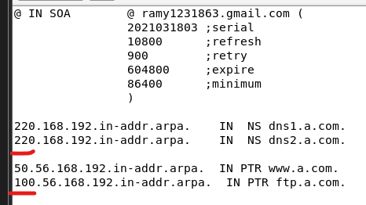  

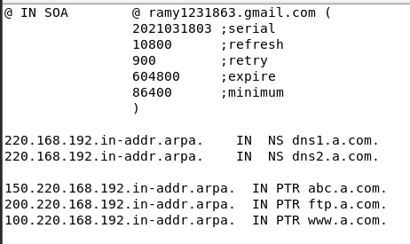  
  
> 根據你的a.com.zone 修改 ip位置對應到domain name

檢查配置檔有沒有問題
```named-checkconf```
重新啟動named
```systemctl restart named```
