Docker
輕量級虛擬化技術

vmware是重量級虛擬化技術
網路空間的隔離

先去安裝docker

> https://docs.docker.com/engine/install/centos/
> docker安裝教程
```

yum install -y yum-utils
```

```
sudo yum-config-manager \
    --add-repo \
    https://download.docker.com/linux/centos/docker-ce.repo
```

```
sudo yum install docker-ce docker-ce-cli containerd.io docker-buildx-plugin docker-compose-plugin
```
```
systemctl start docker
```

```
systemctl status docker
```
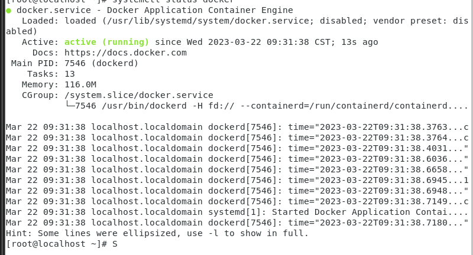  

傳統虛擬化技術

docker engine使用隔離的技術
(不能有相同名字的網路卡)

docker可以實現網路直播嗎

docker c group解說:
>https://www.cnblogs.com/sammyliu/p/5886833.html

image活躍後會變成container

為甚麼image可以創造多個Container
> 跟program 與 process的關係很像

image的作用是甚麼?

docker hub可以賺錢嗎

設置一個自己存放鏡像的位置(防止被盜用)

docker對於vmware的優勢是甚麼

程式寫完就可以把image檔丟到測試工程師那兒

測試沒問題就丟給生產線
LXC
aufs

最上面的一層會在關機的時候不見??

把linux變成路由器

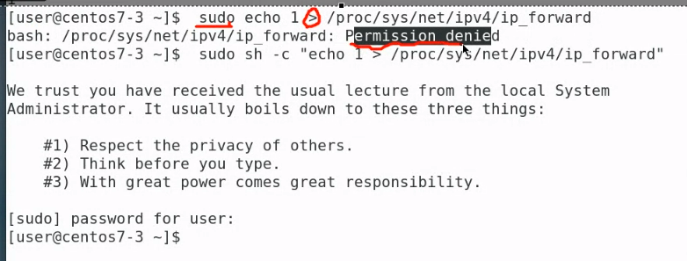  

sh -c "echo 1 > ...." 才能執行

  
> 用來看系統當中有沒有任何的鏡像

下載鏡像
  

可以搜尋centos
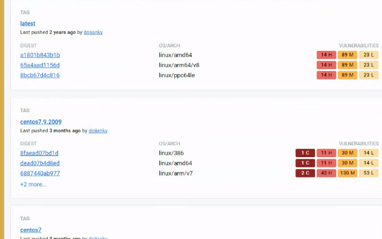  

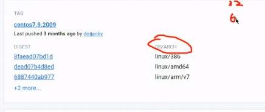  
> 下載時要查看安裝屬性

x86與 arm有什麼差別

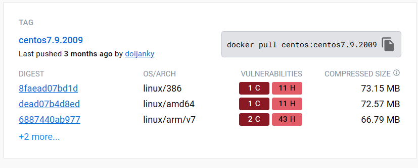  
> 複製他的指令就可以下載了

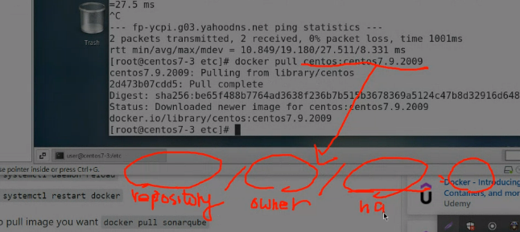  
> 直接從docker hub 可以省略 repository 與 owner 從其他地方可能要寫
>

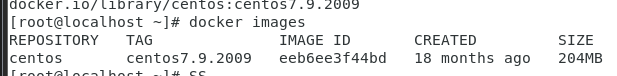  

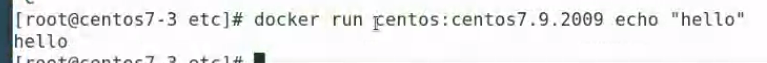  
> 讓docker跑起來

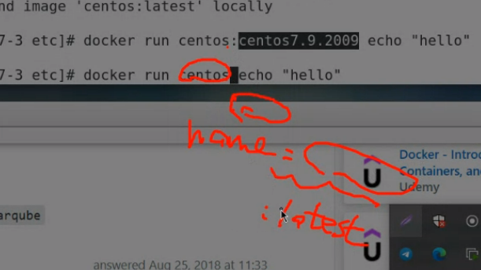  

> 如果 centos後面沒寫預設為 latest
>

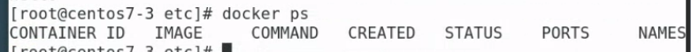  
> 查看docker有沒有在執行

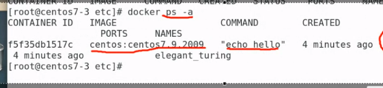  
> -a可以查看歷史紀錄

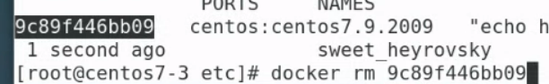  
> 可以使用名稱或著id 就可以刪除了

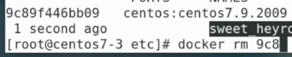  
> id 可以縮寫

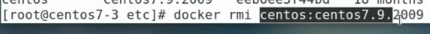  
> 刪除鏡像

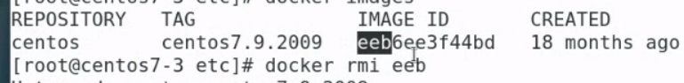  
> 可以用IMAGE ID的簡寫

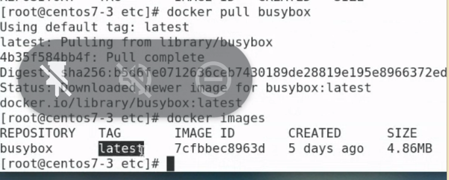  
> :後面沒加東西就會自動下載最新版本(latest)

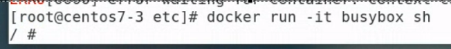  

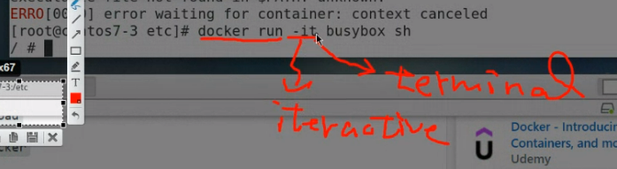  
> busybox只支持shell
>
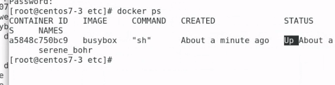  
> 讓他跑sh就會一直執行，沒事做就會關閉

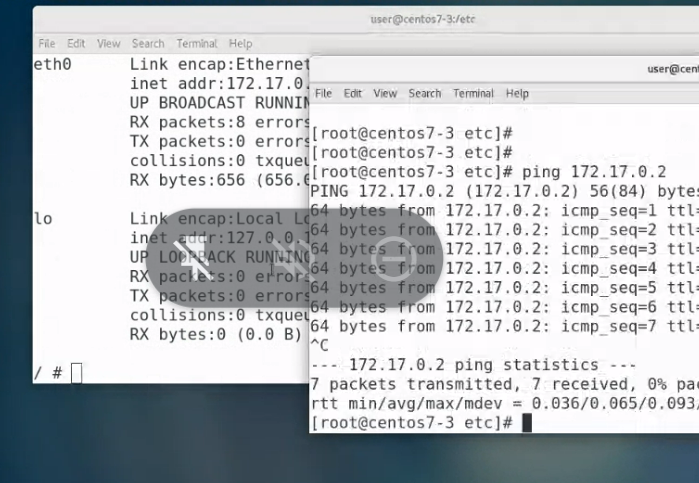  
可以用linux連到你的docker
doceker就像獨立主機
一個linux可以開啟多個docker

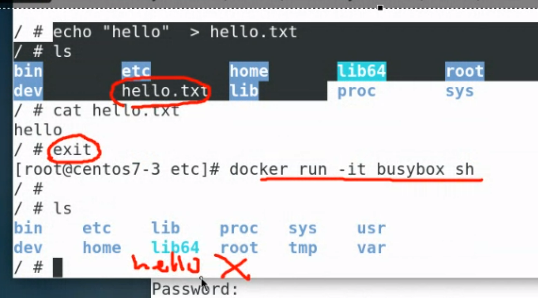  
> 離開之後資料就會消失 所以要創建新的image檔

沒指定docker會自己給你名字

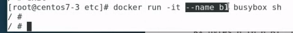  
> 自訂義名字b1

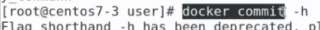  
> 創建新的image

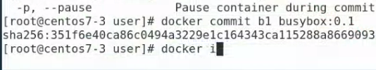  

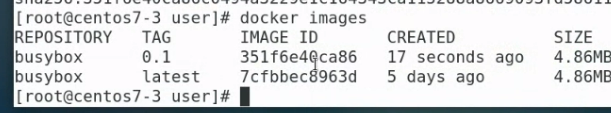  
> 有了新的TAG ->0.1

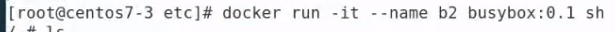  
> 使用剛剛建立的鏡像

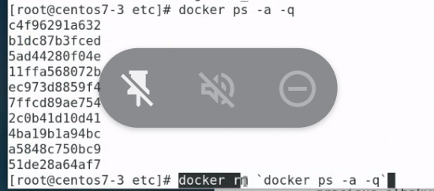  
> 把所有的docker 刪掉，正在運行的他不會刪除

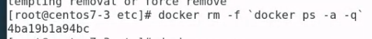  
> 加上-f正在執行的也會刪除

docker也可以下載python
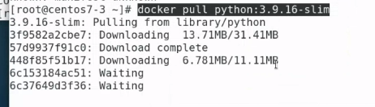  

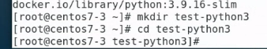  
> 創建資料夾來寫python的程式

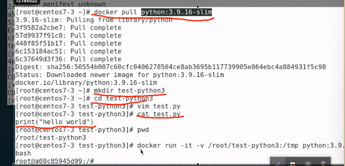  

>把檔案丟到docker 的python去執行

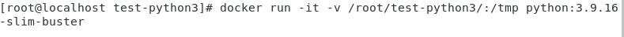  

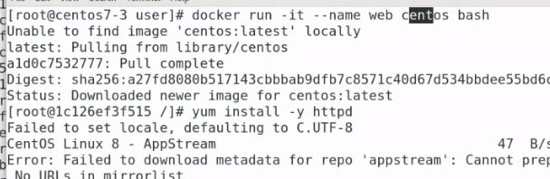  
> 創建一個docker完成網路功能

  

>使用2009版本

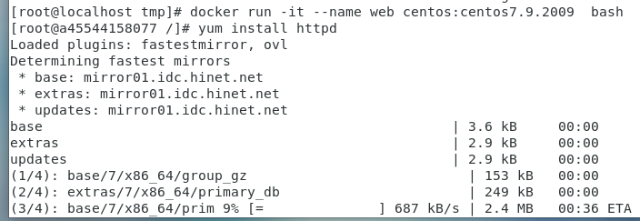  
> 創建一個docker並安裝httpd


