讓docker在背景執行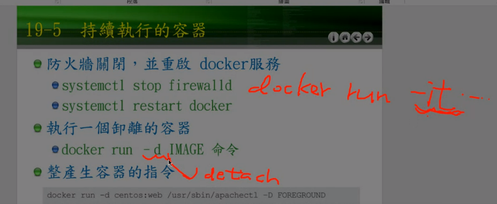  

systemctl 是一些代碼的封裝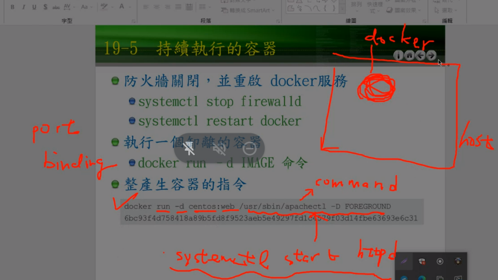  

```
docker run -d -p 8000:80 centos:web /usr/sbin/apachectl -DFOREGROUND
```
> 把localhost 的8000 port 綁定docker的80 port


  
> host綁定docker

  
> 測試8000是不是有人使用

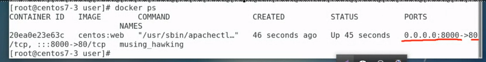  
> 本地端任意一個8000 port 會指向docker的80port

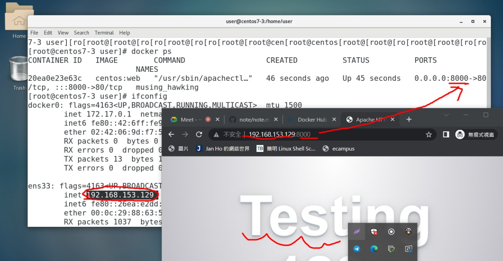  

鏡像打包
  
> 可以從外地下載docker的壓縮檔來安裝docker

導出鏡像
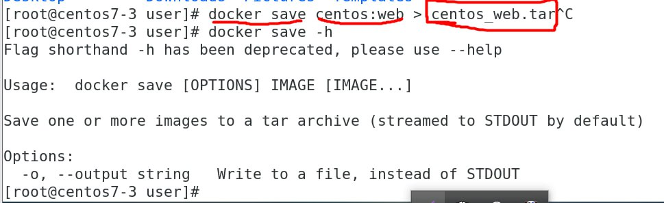  

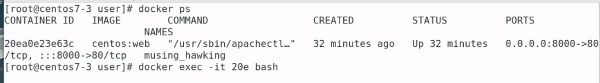  
> 使用id執行相對應docker

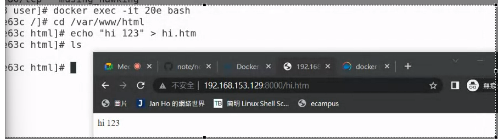  
> 在docker 的centos建立網站

另一種方式:
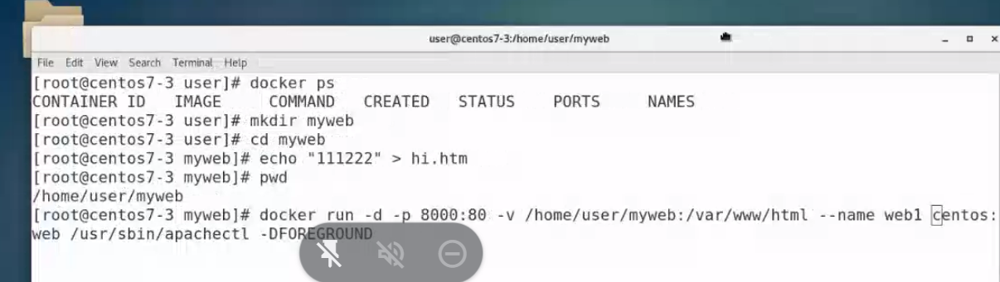  

  


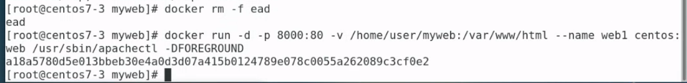  

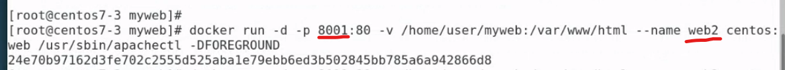  
> 修改名稱及port就能夠快速創造出多個docker 
> 應該有更快的方式，使用腳本?

  
> 把所有docker先砍掉 因為要使用腳本來執行創建

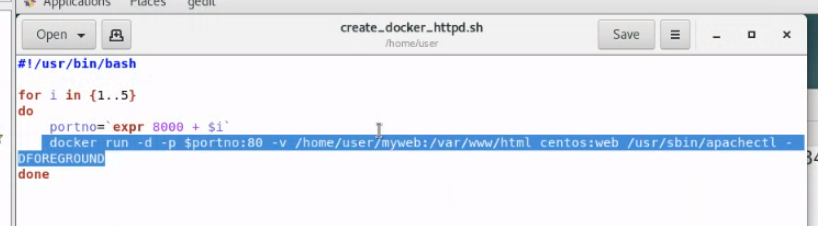  
> 創建一個docker_create的bash

```
#!/usr/bin/bash

for i in {1..5}
do
    portno=`expr 8000 + $i`
    docker run -d -p $portno:80 -v /home/user/myweb:/var/www/html centos:web /usr/sbin/apachectl -DFOREGROUND
done
```
執行腳本(使用bash)
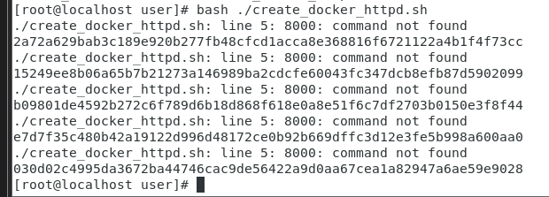  


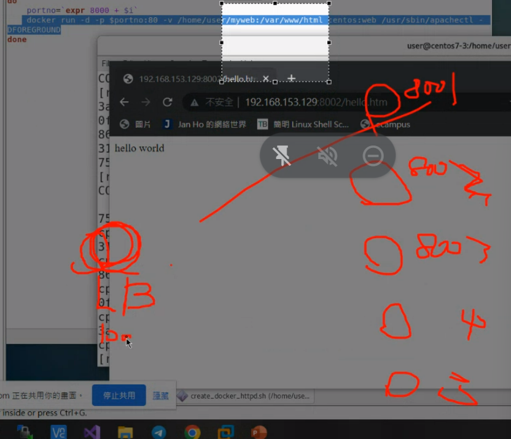  
> 通常會建置一個load balancer來分配負載請求?


haproxy可以達成load balance


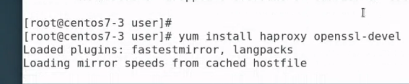  
> 安裝haproxy與ssl

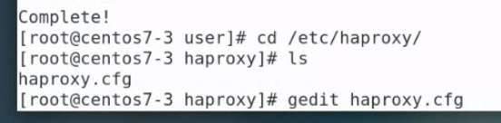  
> 移動到haproxy的conf

>https://github.com/FUYUHSUAN/note/blob/master/110-2%E8%87%AA%E5%8B%95%E5%8C%96%E9%81%8B%E7%B6%AD/2022_03_16/note.md

貼上學姊的代碼
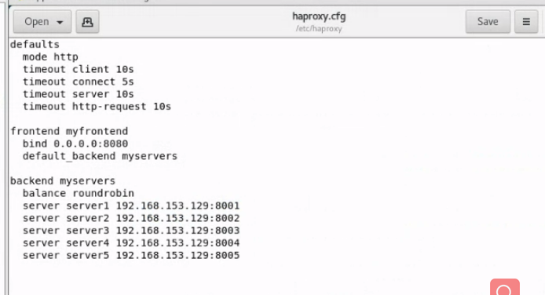  

```
defaults
  mode http
  timeout client 10s
  timeout connect 5s
  timeout server 10s
  timeout http-request 10s

frontend myfrontend
  bind 0.0.0.0:8111
  default_backend myservers

backend myservers
  balance roundrobin
  server server1 192.168.220.145:8001 check
  server server2 192.168.220.145:8002 check
  server server3 192.168.220.145:8003 check
  server server4 192.168.220.145:8004 check
  server server5 192.168.220.145:8005 check
```
> 我進行了修改

在上面的配置檔案中，我們將伺服器（server）的定義更改為使用本地地址和 Docker 容器的端口。例如，127.0.0.1:8001 代表容器的 IP 地址為 127.0.0.1（也就是本地地址），而容器的端口為 8001。然後使用輪詢（roundrobin）平衡負載方式來分發流量到這五個 Docker 容器，並檢查這些容器是否可用（check）。

如果您已經將 HAProxy 的配置檔案保存在主機上，您可以使用以下命令在 Docker 上運行 HAProxy 容器：

```
docker run -d -p 8111:8111 --name haproxy -v /etc/haproxy/haproxy.cfg:/usr/local/etc/haproxy/haproxy.cfg haproxy:latest
```
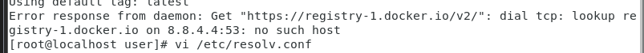  
> 遇到問題

解決方法:
> https://blog.csdn.net/qq_63698117/article/details/128917454


重新執行
```
docker run -d -p 8111:8111 --name haproxy -v /etc/haproxy/haproxy.cfg:/usr/local/etc/haproxy/haproxy.cfg haproxy:latest
```

執行 create docker遇到問題
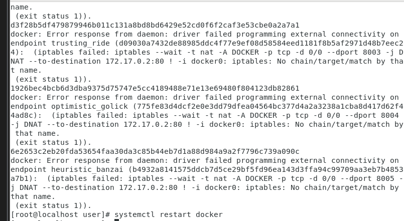  

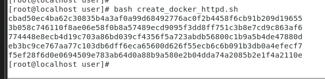  
> 重新啟動docker就能夠執行 sh檔了

```
[root@localhost user]# docker run -d -p 8111:8111 --name haproxy -v /etc/haproxy/haproxy.cfg:/usr/local/etc/haproxy/haproxy.cfg haproxy:latest
86a6813a28778b1219272002a771282fe5dd06c114350a9002d5b3dc8405066d
```

```systemctl start haproxy```

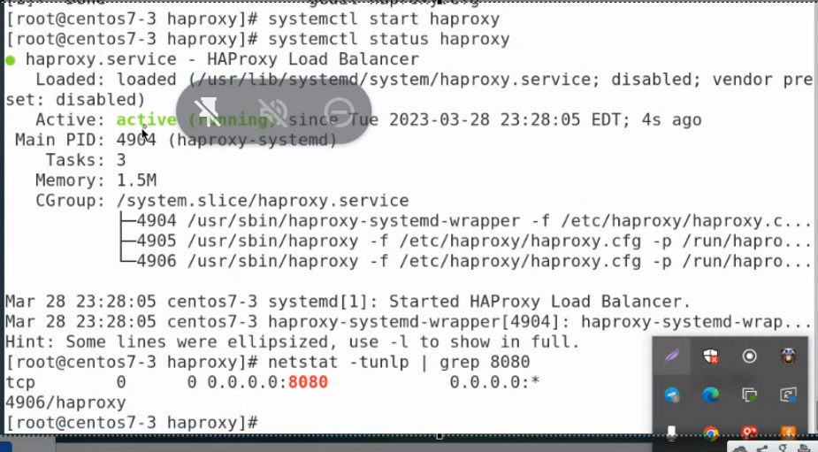  
看他有沒有成功運行

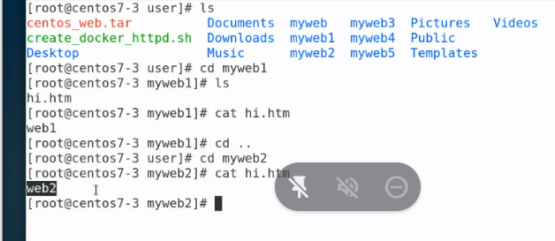  
> 創建5個資料夾

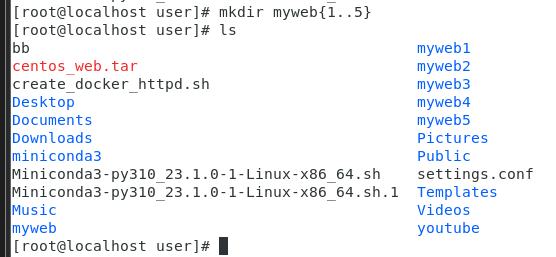  


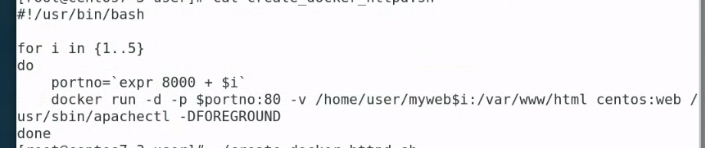  
> 修改create sh檔
> 就能夠展示loader balance的效果了

修改haproxy
```
    server  app3 127.0.0.1:5003 check
    server  app4 127.0.0.1:5004 check

defaults
  mode http
  timeout client 10s
  timeout connect 5s
  timeout server 10s
  timeout http-request 10s

frontend myfrontend
  bind 0.0.0.0:81
  default_backend myservers

backend myservers
  balance roundrobin
  server server1 192.168.220.149:8001 check
  server server2 192.168.220.149:8002 check
  server server3 192.168.220.149:8003 check
  server server4 192.168.220.149:8004 check
  server server5 192.168.220.149:8005 check                                    
```

```bash create_docker_httpd.sh```

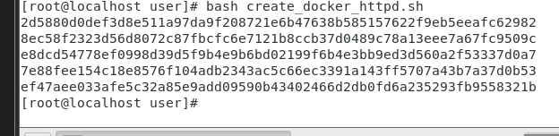  

先刪除所有docker
```docker rm -f `docker ps -a -q` ```

創建一個docker連接到haproxy
```
docker run -p 81:81  -d --name haproxy-master -v /etc/haproxy/haproxy.cfg:/usr/local/etc/haproxy/haproxy.cfg --privileged=true haproxy
```
> 我的81 port 已經在使用了修改為別的port -> haproxy.cfg也要修改

執行 create_docker.sh
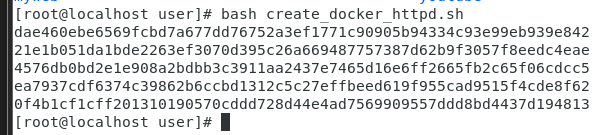  


雲端備份

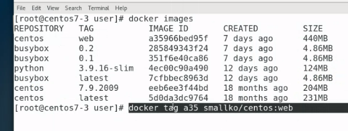  
> a35是id 給他一個新的標籤名稱 要更改是因為要符合它上傳的規定?

以下是我的 /前面要是你的docker username


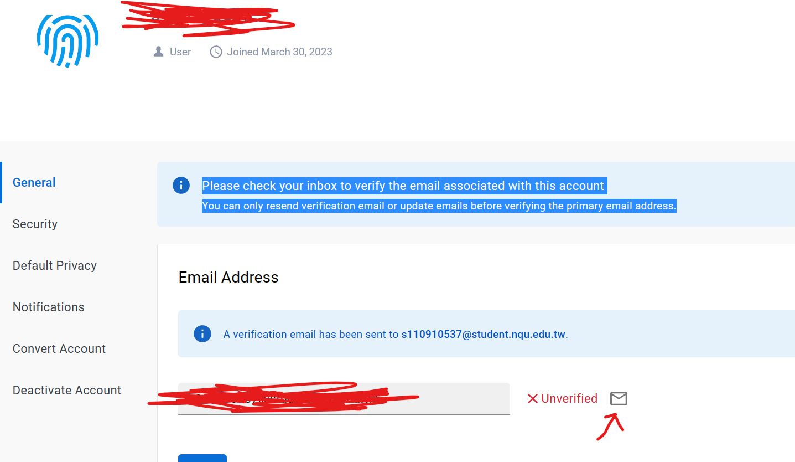  
> login前請驗證信箱

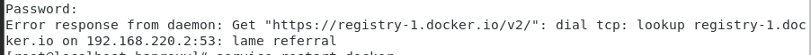  
> login時出現error

修改
```vim /etc/resolv.conf```

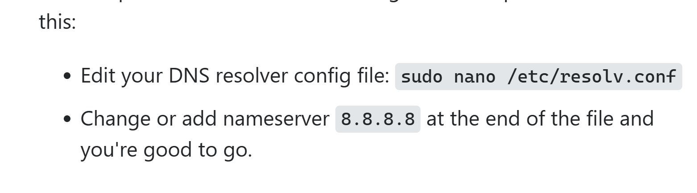  

之後就成功登入了

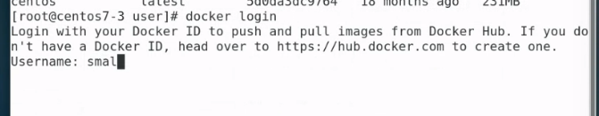  
> 登入docker

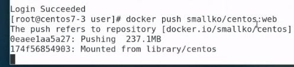  
> 把鏡像推送到雲端

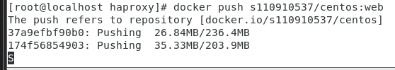  
> 成功推送!!

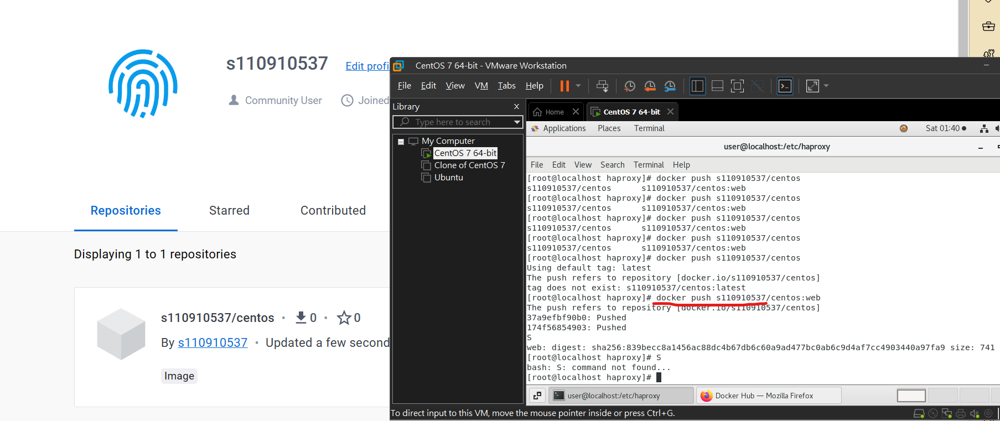  


下載docker

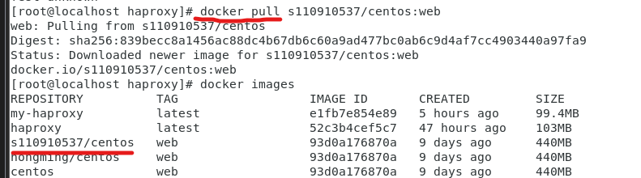  
> 下載成功


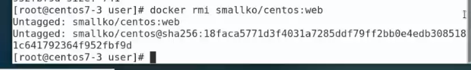  
>先刪除因為我們要測試從網路下載

rmi失敗可能是image在執行

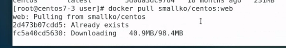  
> 貼上docker hub的網址


正確版本:
先關閉防火牆跟selinux(害了我好久!!!)

```systemctl stop firewalld```
```setenforce 0```

建立五個網頁伺服器網頁內容分別為web1~web5
prepare_web.sh
```
#!/usr/bin/bash

for i in {1..5};
do 
    mkdir -p myweb$i
    cd myweb$i
    echo web$i > hi.htm
    cd .. 
done
```
執行
```bash prepare_web.sh```

編輯掛載資料夾docker_httpd_setup.sh gedit docker_httpd_setup.sh

```
 #!/usr/bin/bash

for i in {1..5}
do
    portno=`expr 8000 + $i`
    docker run -d -p $portno:80 -v /home/user/myweb$i:/var/www/html centos:web /usr/sbin/apachectl -DFOREGROUND
done
```


打開docker: systemctl start docker

刪除所有docker
```docker rm -f `docker ps -a -q` ```

執行docker_httpd_setup.sh
```bash docker_httpd_setup.sh```

安裝haproxy
```yum install haproxy```

```cd /etc/haproxy/```
```vim haproxy.cfg```
寫入以下內容
```
defaults
  mode http
  timeout client 10s
  timeout connect 5s
  timeout server 10s
  timeout http-request 10s

frontend myfrontend
  bind 0.0.0.0:8080 (任意改妳要的port[localhost])
  default_backend myservers

backend myservers
  balance roundrobin
  server server1 192.168.48.171(vitual machine ip):9001 (docker對應到的虛擬機port)
  server server2 192.168.48.171:9002
  server server3 192.168.48.171:9003
  server server4 192.168.48.171:9004
  server server5 192.168.48.171:9005
```

打開電腦的瀏覽器
打上你虛擬機的ip ex(192.168.48.171)
```192.168.48.171:8080```
> 8080對應到bind的 port

享受loader balance吧~


