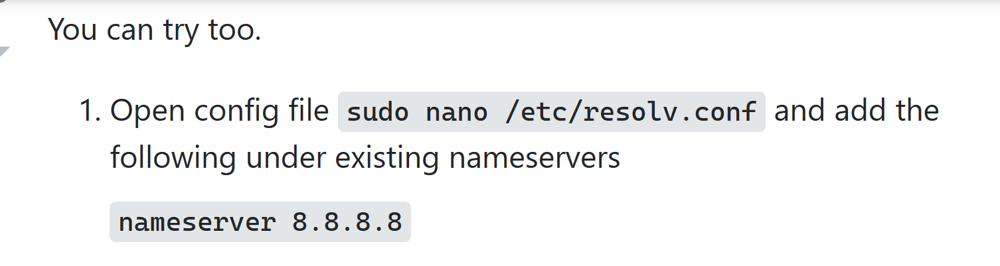
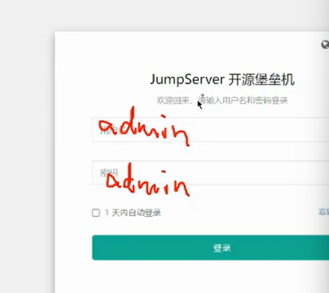
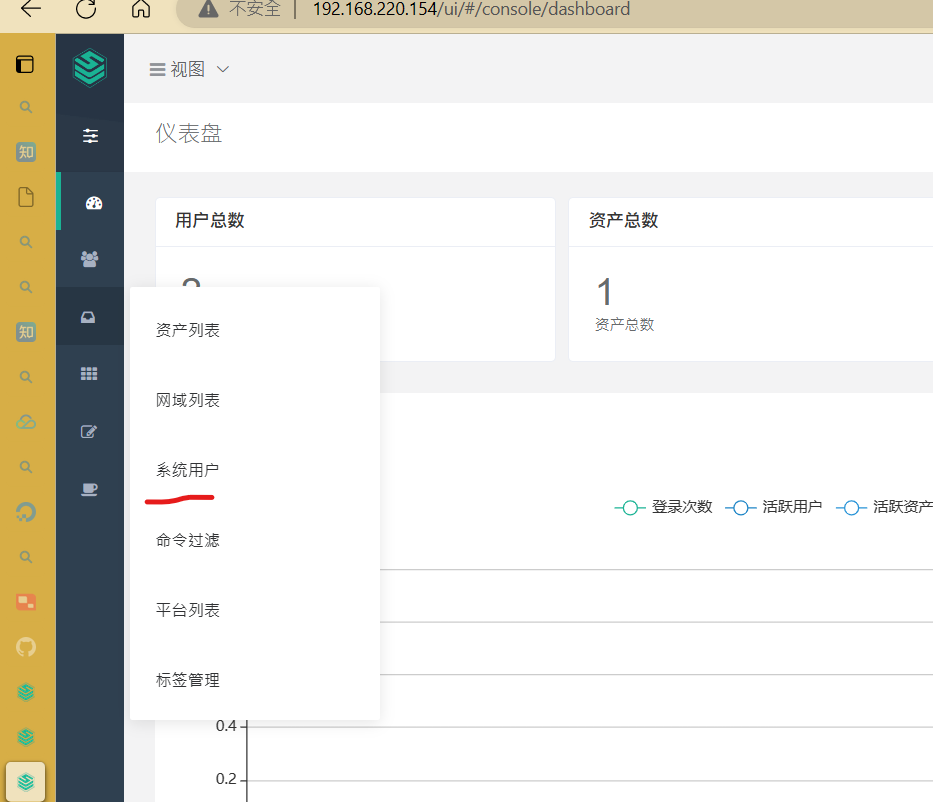

Docker沒做事就會死掉，是我們學習的好榜樣


不想手做就要使用Dockerfile

  

```
mkdir test-dockerfile
gedit Dockerfile
```


在裡面輸入
```
FROM centos
RUN yum -y install httpd
EXPOSE 80
ADD index.html /var/www/html
```

  
> From 的位置是不是要對應的名稱? 沒錯....

加上首頁:
```
cd test-dockerfile/
echo "wanghongming" > index.html
```

於terminal輸入:
```
docker build -t hongming:httpd . 
```
進行編譯:
  

有時候會出現編譯上的錯誤，我想這是docker image的問題，但是我想要重新pull docker image 的時候他卻不給我pull ，網上寫的方法是說要改dns位置
```
sudo vi /etc/resolv.conf
```

把裡面的nameserver 改成 8.8.8.8 
(google 的dns)

之後再重新啟動docker 就能夠pull 了
```
systemctl restart docker
```

問題是要怎麼幫docker image改名?
```docker tag 原本image名字或是編號 想要的名字:版本號```

  

終於好了!!

15:58
 

  

之後查看自己的ip位置
  

在瀏覽器上面打上 你的ip位置:8888
成功使用doceker創建網站
  

JumpServer~~

docker compose?
**就很像Anaconda一樣管理版本吧...**

  

啟動優先權

## 安裝Docker Compose
> https://vocus.cc/article/5fbc6e73fd897800016cc9f6

建立Docker compose資料夾 並進入
  

需要準備這個檔案
  

   
> 輸入以上內容，image要根據你的image來進行更改，縮排要注意不然會錯誤

  

  
> -d 在背景執行

查看docker-compose的執行
```docker-compose ps```

  

  
> 關閉docker-compose 輸入up 與dowm都要在對應的資料夾下

使用docker compose 可以幫助你高效的管理腳本

JumpServer可以保護伺服器，能夠紀錄對伺服器的操作。
進行Accounting的動作

Jumpserver怎麼使用防火牆擋住攻擊?

> https://github.com/wojiushixiaobai/Dockerfile
> 下載JumpServer

```
# 测试环境可以使用，生产环境推荐外置数据
git clone --depth=1 https://github.com/wojiushixiaobai/Dockerfile.git
cd Dockerfile
cp config_example.conf .env
gedit .env  #把DOCKER_SUBNET = 172.20.0.0/16
docker-compose -f docker-compose-network.yml -f docker-compose-redis.yml -f docker-compose-mariadb.yml -f docker-compose-init-db.yml up -d
```
  
> 發生了點錯誤

  
> 把/etc/resolv.conf 裡面的nameserver 只留下 8.8.8.8 就可以解決這個問題了

  
> 安裝中


```
docker exec -i jms_core bash -c './jms upgrade_db'
```
先查看80 port有沒有被做使用
```
netstat -tnulp | grep 80
```
  
> 很好現在沒有人使用，如果有的話可能要kill 掉process

最後執行:
```
docker-compose -f docker-compose-network.yml -f docker-compose-redis.yml -f docker-compose-mariadb.yml -f docker-compose.yml up -d
```


  


  
> 成功進入


  
> 預設帳號密碼

  
> 需要修改帳密

  

  
> 配置用戶訊息

  

  

按下Submit

測試Tom登入

OK 切換回Admin帳號
修改Asset

  


  

提交
  
> 可以看到資產總數增加

  
> 選擇系統用戶

  
> 創建SSH

  

  
> 之後是Permisson asset

  

確認SSH是否開啟
```systemctl start sshd```

要創造admin user
  

  


  

  

  

  
> 資產的特權用戶要設定為root

  
> 資產授權 創建


