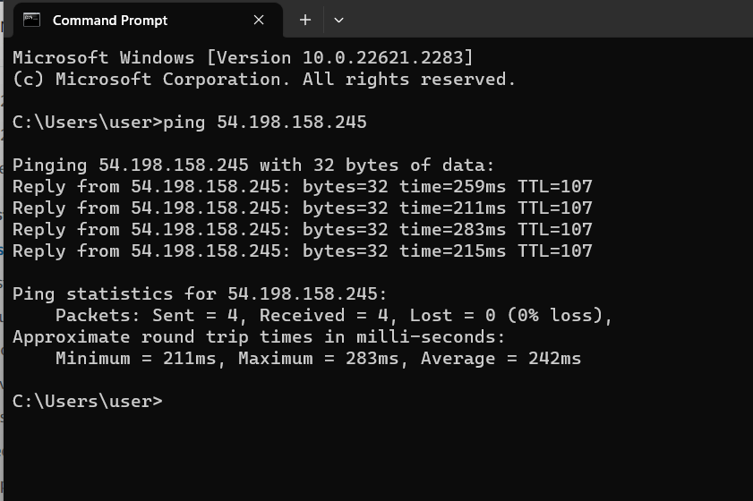

## Home work:
  

  

  

碩士論文需要有一定的意志力不然完成不了。

這門課需要有扎實的Linux操作基礎，如果沒有基礎的話會學得很辛苦。
這節課需要使用到amazon的aws
能來上課就來上課，這門課一定要動手做
這們課會介紹關於aws的操作，
為甚麼要學aws? 有微軟有google的平台為甚麼要學aws??
答案: aws是全部市佔率最高的，學完如果要去找相對應的工作可以符合需求，
學完aws很容易掌握別的平台，有一些東西我們能夠講，雲端的平台會提供儲存的資源，運算的資源
計算，在雲端開設一台虛擬機，如果不構可以開更多，可以根據需求配置機器的運算效能，
這是看工作的性質，計算輛cpu ，容量:記憶體，
伺服器會去把資料從sql拿出來再給網頁但是速度比較慢，
因為從傳統硬碟讀取，
解:從網路跟網頁伺服器之間去使用快取資料庫 ex: radis
  

AWS的伺服器分布極廣在世界各地都有機會看到牠的蹤跡:
  

以記憶體為導向的資料庫(aws可以提供)
可以選擇傳統的硬碟或ssd
還是很大的儲存磁帶
可以客製化你想要的機器將它產生出來
AI在運算的時候需要大量的運算，如果記憶體不夠好的話就可以使用AWS的服務，可以克制出你需要的資源
你用多少就收多少錢，不需要馬上買一台1，2十萬的電腦

計算資源再aws叫做ec2
也叫做計算資源，
要創造虛擬機，根據自己的需求來創造虛擬機，
有時候只要一台機器就可以完成了，
架一台網頁伺服器，只有單一台機器，機器掛= 伺服器掛
所以怎麼建立多台伺服器是很重要的事
如果要建4台虛擬機，一直掛者沒用就會造成浪費
但是aws提供了 auto scaling
可以做一些監控，
如果我有一台虛擬機，cpu已經跑到80%它會自動幫你生成一台虛擬機
如果只剩30%就自動幫你關掉虛擬機，可以自動調整避免浪費
aws有很多東西都是免費的(一年)
但如果想要做一些特殊的功能就需要加一些錢
我們會控制在100 ~ 200元之間
註冊Domain name
 a.online ...
 台幣50元以下
要搭配服務需要註冊
aws管理dns的服務 0.2 dollar
如果超量就會扣錢，
為甚麼要這樣去做?
如果之後要去外面學這些需要付出很多金錢經歷
學這些可以幫助你之後求職
安全性上面做得很好(比自己架的)
s3 儲存
比較有名的儲存
google drive one drive
s3也是雲端當中amazon提供的服務
除了可以用來儲存我們的資料
大數據分析也可以使用到，運算 模型 預測
也可以做個人的靜態網站
http 網站(過時)
透過一些額外的設定變成https的網站
vpc : Network
並不是所有的機器都能面向大眾 會被盜用
資料庫都會放在私有網路
把網站放在公有網路
創造網路:
  

可以隔離網路，彼此不會互相影響，除了這些，這學期還會去講自動化的部分
手動的話:慢 管理維護較差
雲端的服務在世界上有很多中心
亞洲的 歐洲連線就會比較慢，所以可能有複製資料的情形
判斷你在哪個地區，就能夠加快速度
自動化 json yml
這些配置檔配置好了就可以根據我們的設定來快速部屬
無伺服器架構
serverless
重要的點是:有些人只Care可以提供多少服務，但他又不care配置
所以amazon就可以自動幫你配置，你只要提出需求就可以了，

雲端技術: k8s docker
aws在業界工作有經常使用到
所以學的aws比docker還要重要

期末沒有交筆記絕對被當掉喔!!!
操作的不好做不出來需要有老師的協助，所以要來!!

期中會出題目
老師比較Care筆記
把一些重要的過程加上說明加上圖
比較容易看到你整個學期學到甚麼東西
如果有這些筆記就比較容易去複習了
因為我有做這些東西，所以個人履歷就能夠展現出我的專業

aws架構師?
為甚麼要學?
因為就業市場問你他在說甚麼的時候你可以說出來
  

docker不是不講 是因為aws比較重要
第九週就是做練習
參考教材:
  

首先要做的就是註冊aws
  

帳號具有最高的權限
所以不太會使用這個帳號
可能會開用戶帳號否則會造成資安的漏洞

login page
  

登入後:
  

Home Page:
  

Can i have bill?
這多少錢?

EC2 DashBoard
  

為了不要付冤望錢下課後把instance(實例)刪掉

  

Elastic Compute Cloud (EC2)
  

  

  
  

我們比較常用到amazon的鏡像
它是免費的
之後就是挑作業系統
AMI amazon Machine Image

Instance type
有些是需要計算有些要儲存，根據需求來配置
t2.mircro -> free
  

給你最簡單的配置
t就是type 通常數字越高要付的錢就越多
  
c代表 Cpu會比較強一點

在學習的時候使用免費的就好了，
職場的話則要求穩定
我們選t2.micro

key pair(login)
遠端登入到虛擬機，需要使用ssh連線
必須在這裡設定公鑰及私鑰
我們沒有鑰匙所以要點create key

  

linux .pem
windows .ppk

我們選擇 .pem 因為我們比較常用cesntos 跟 ubuntu

按下generate
這個key要儲存起來，不要讓別人知道，否則會有問題，之後我們上課會用所以位置要記住

Network setting
我們會有一個預設的網路這個網路叫做default 
vpc -> default
在default裡面會有一個子網路
之後我們會把我的ec2建立在裡面
到時候ec2在裡面會有一個igw
internet gate way
ec2會透過 gate way雙向連接

這個部份我們先預設
auto assign puclic ip 要設定為 Enable

只需要設定這裡就好了，這裡是管理對外的Ip
接下來就是關於防火牆安全的部分
一種是 create security group
一種是 select existing security group

甚麼資料可以進來甚麼資料可以出去這就是security group

預設就是都不能進來，但是流出去可以
給他一個名稱叫做 sg-test
descripe sg-test 
設定ssh
source type

在aws裡 0.0.0.0/0 代表來自任何地方
如果今天我們想要製作一個網站就選擇
http 22 port and 80 port

  

安全我們開ssh and http

configure storage
根據不同的需求選擇儲存媒介

在右邊會有summary 
你可以直接選擇你要開幾台

user data
如果你希望扛開機就執行一些東西你就可以把腳本寫在這裡

下面會顯示第一年的優惠，
你不要真的覺得是750個小時，應為他是看全部虛擬機的總合的

好的時候
  

下面有個detail
狀態要是running
內部ip
外部ip
需要留意

右上角有個cloud shell 可以出現CLI
你在這邊就可以輸入linux還是你選擇的作業系統的指令

  

好像沒有辦法ping
但我們現在已經通過power shell 連接到我們的 virtual machine

ifconfig 的指令找不到的話可能是你還沒有有安裝

有一個地方要修改
選擇instance id 
security

  

選擇connect

  

  

  

連接到虛擬機，剛剛做的有些錯誤
虛擬機已經可以去ping外網

公有ip也可以被windows ping到?(不行)
ICMP沒有開啟 外網不能夠連進去

SECURITY GROUP
如果想要讓他可以PING
點選這個

第二步在這裡

接下來開啟ICMP
ALL ICMP -> SAVE

應該就沒什麼問題了

終止的話就點選虛擬機
TERMINATE INSTANCE
選擇 TERMINATE
等一下就可以看到刪掉了