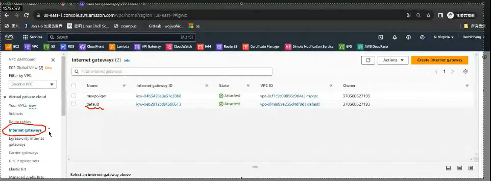
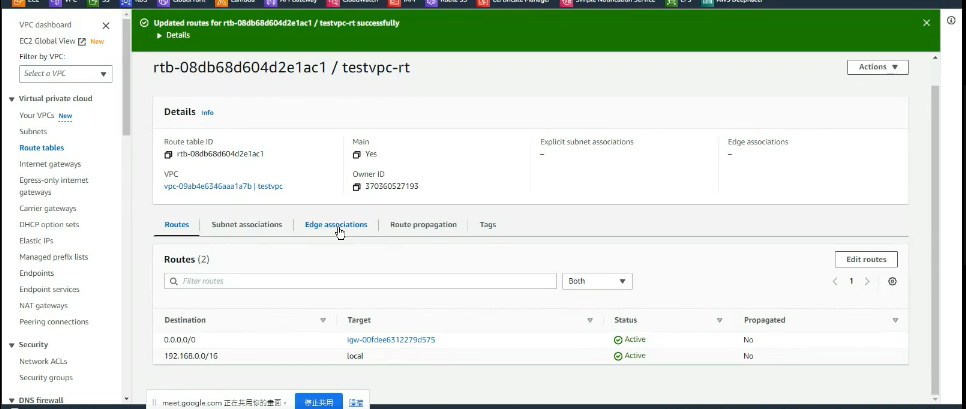
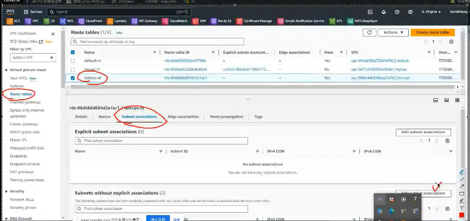
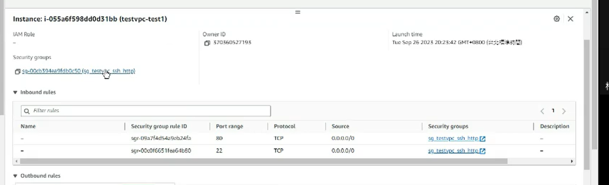

虛擬的雲端中心會有私有的網路，裡面有IGW 可以連接到外面的internet,外面也可以根據IGW連接到內部

為甚麼要有這樣的架構?這個是直接面對到網路伺服器的客戶，資料庫的內容是不需要對外的，可以透過外部網路連接到資料庫，外部網路沒有辦法獲取內容，這張圖主要要講NAC
  

最主要要控管subnt的流量，可以允許什麼樣的資料近來什麼樣的資料出去，另一個重要的事情就是它是一個無狀態的保護，也就是近來跟出去都要檢查一次，不會記錄之前的檢查紀錄，

SG跟NACL的不同是

近來是SSH的流量，並且從某一台機器來的，SG只要知道這個流量已經檢查過了就會直接放行不會再繼續檢查，這就是有狀態的檢查

一個是針對虛擬機，一個針對網路(無狀態)

如果操作的介面是中文的話就切換成英文的，比較好做教學

這張圖主要講的是NAT GateWay

  

NAT 
剛開始虛擬機沒有裝東西，需要安裝，就可以透過Nat gate way 連接到網路上

只允許內網連接到外網去下載東西，但是不允許外部網路連接到內部網路

ENI -> Elastic network interface

在aws，你可以在創造ec2的時候他幫你生成，或是你手動的創見出來，當你手動創建出來的時候，他可以綁定一個public IP連接到外部的網絡，

假如虛擬機壞了可以把ENI放到另一個虛擬機上面。

假如這個虛擬機提供的是mysql的功能，但我要升級他，所以我必須要暫停虛擬機，現在我就使用備份的虛擬機，並且將網路卡連接到這台備份的虛擬機上面，接下來我就可以輕鬆的來維修這台虛擬機了。

我們在做EC2的時候要了解兩種儲存的媒介
  

一種是快速版，可以很快速的讀取資料，但關機之後資料就不見，另一種就是EBS
Elatic block 網路儲存裝置，但是缺點就是比較慢一點，可是他的儲存時效是永久的。爾且他有備援(差異式備份)

ELB
Elastic load balancer
來達到負載均衡
讓更多的人得到更快的服務，美台機器都可以提供服務當然能夠提升

ASG會根據你的流量來自動的增加instance
  

當然沒有這麼多請求的時候他也可以自動的縮減instance

如果沒有圖的話就很難能夠知道為甚麼這麼做,會使用雲端技術的基本上都是比較中大型的公司，使用的介面也基本上是英文的如果使用中文就很難去知道這個名詞的用途是甚麼(或許熟練了也可以，但基本上需要加強英文與趕)


testvpc 我們會在裡面建置網路，接下來接遇到我們的公有網路testvpc-public跟私有網路testvpc-private還有一個igw可以連接到外部網路，我們會建立兩台EC2，一個在私有網路一個在公有網路，到時候就來模擬網頁伺服器，igw會存取我們的public www我們會在 public這面放一個natgateway，讓資料庫可以連接，以下就是我們的基本架構圖
  

最一剛開始的時候選擇VPC

  

選擇Your VPCs New 選擇Create VPC
  

接者給她一個名稱叫做testvpc

規劃:這個vpc我們使用192.168.0.0/16來代表vpc的網路 我們有兩個subnet
一個是public 跟 private
public -> 192.168.0.0/24
private -> 192.168.0.0/16
  

今天我們先做ipv4的教學
  

  

接下來要建立子網路
  

  

  

  

抓兩張圖，一張是VPC 一張是創建兩個子網路

創造testvpc要先記得一件事情
我們有兩個subnet 他們的預設值都是私有網路，並不會因為取名字就讓它變成對外網路，因此你必須要有一個internet gateway才能夠對外連線

0.0.0.0/0任何位置都可以透過igw來連線


選擇internet gateway


名字標明testvpc-igw 
創造好了之後就會像這個樣子

那等等要按 Attach to a VPC
要先選testvpc-igw

之後就會顯示此葉面

之後按下黃色的那個按鈕

到internet gateway這個選項就可以看到testvpc-igw 已經配置好vpc

有些人會習慣有一本書，但書需要製作的時間，有可能致做出來的時候介面已經做了更改，此時書的作用就大大的減小了，需要debug

先到Route tables
把-變成testvpc-rt


到Route tables 選擇testvpc-rt 屬性欄選擇Routes -> Edit route

  

0.0.0.0/0 任意的位置
丟到internet的gateway上

  

  


之後點選儲存

就可以看到這個介面
  

我們要讓subnet與igw進行連結

所以到Route tables 點選textvpc-rt -> Subnet association

  

進行編輯
Edit-subnet-association


把public勾選出來選擇save

做完之後就會像這樣

public上private下

這樣我們的網路就配置得差不多了

SUBNET PUBLIC就可以透過IGW連接到外網

當我們看到ROUTES這邊有0.0.0.0/0的資訊代表我們配置成功

現在要建立兩台虛擬機，一台放在PUBLIC裡面一台放在PRIVATE裡面。

PRIVATE跟PUBLIC可以進行通訊但不能對外

PUBLIC負責對外

我們透過SSH連接到PUBLIC的主機

  


EC2 -> INSTANCE 


創建INSTANCE

  

T2.MICRO

KEYPAIR 選擇一個或創建

網路設定
  

新增規則

  


USER DATA需要程式碼


```
#!/bin/bash
yum update -y
yum install -y httpd.x86_64
systemctl start httpd.service
systemctl enable httpd.service
echo “Hello World from $(hostname -f)” > /var/www/html/index.html

```

虛擬機在開機的時候就會執行以上的腳本

接下來就可以LUNCH
  

接下來輸入ip 於瀏覽器但由於我們沒有購買HTTPS功能所以只能使用HTTP的方式來進入網站
  


私有ip及公有ip
  


接著抓一下成功顯示的圖片
  

使用我們的虛擬機登入到AWS的虛擬機(PUBLIC)
  

測試SSH可不可以使用

我們剛剛開放HTTP 與 SSH所以現在進行測試

可以抓一張登入成功的圖片
  

開了一個WINDOWS的終端機
PING我們的AWS虛擬機但是為甚麼不可以PING到??

選擇TESTVPC-TEST1
找到SECURITY GROUP

點進去
  


  

EDIT INBOUND RULE

ADD RULE -> ALL ICMP IPV4 -> ANY WHERE -> SAVE RELES

如果想要增加其他的網頁

```
cd /var/www/html

sudo bash -c 'echo "hi" > hi.html'
```
  

有時候我們沒有辦法直接更改 /var/www/html的檔案
就算使用sudo也不能

所以就有
```
sudo bash -c 'echo "hi" > hi.html'
```
這種用法

成功的新增了hi.html這個網頁
  

網站現在建好了，就可以把東西丟上去

假如在Window開一個word檔，
找一個蘋果的照片貼上去

儲存成html檔案，現在要把他上傳到linux機器上面

接者查看本地linux 的ip位置
使用winscp連接到虛擬機的位置

輸入帳號與密碼把apple與另一個產生的applefiles上傳到linux上面

接者就是想要讓他在aws的網站上面可以顯示

使用Winscp把它copy到 自己的機器上面


使用scp的方式將檔案上傳到aws上面
  

  


更改在aws虛擬機上html與其檔案的位置:
  


就可以看到看到我們網站

aws雖然很方便，但其實對架網站來說還是有點貴的...

現在Stop instance，就可以不用消耗流量，避免損失金錢，

> tips: Stop再重開IP位置會改變!!

雖然stop再開啟ip的會改變但，裡面的檔案不會不見，如果選擇terminate就會銷毀資料

## 抓一張網站的圖

