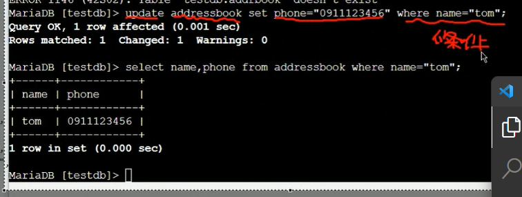
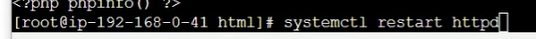
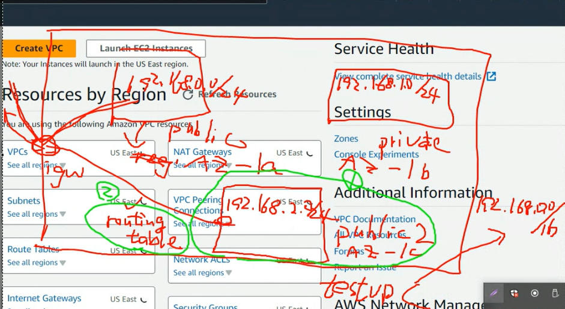
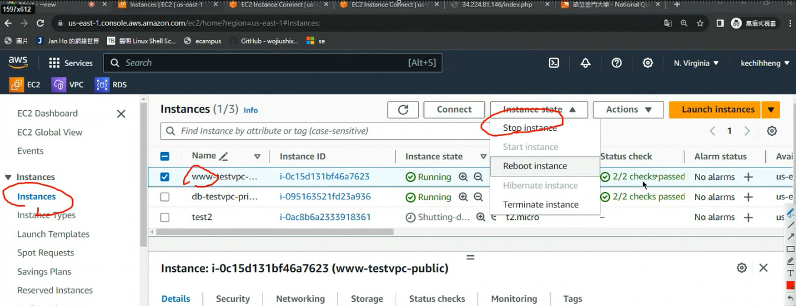

TestVPC裡面有兩個subnet 我們在public裡面建立ec2 一台在private裡面也有一台EC2

  

我們上次安裝了mariadb 需要配置一些設定，下載mariadb的時候需要internet gate way 

  

最後刪除nat gw 不然會被扣錢
(其實已經花了一點錢)

先啟動我們的機器
  

一種透過ssh的方式連接上去或者直接使用網頁做連接

按下connect
  

  


我們要連接到資料庫
  

需要知道他的私有ip
再透過Public連上去

   

開兩個視窗一個連接到public 一個連接到private (db)

進入 maria db 
  

## 貼一下登入資料庫

顯示資料庫
  


創建資料庫 test_db
  

  

創建通訊錄
  

  

插入一筆資料
  

創建mary用戶
  


  

  

列出Tom的電話跟號碼
  

更改Tom數據
  

db的位置要根據自己的來調整 
  


再做一次查詢的指令
  

在www 虛擬機安裝httpd
  

```shell
sudo yum install php8.1 php8.1-fpm.x86_64 php8.1-mysqlnd.x86_64 -y
```

安裝php mysql ...
  

切換到html目錄
  

先修改root的密碼
  

為123456 (如果你記得就不用改)

之後輸入su 
它會讓你輸入密碼

編輯test.php
  

用來測試php可不可以使用

裝完之後要重新啟動網頁伺服器
  

若你想要用本地端做連線
  

切換為超級使用者
確認httpd是running的
  

編輯一下php檔案
  

切換到html 編輯test.php
  

獲取www的public ip
  

如果出現上圖就代表成功
## 貼一下圖片

寫一個php檔案

創建index.php
  

```php
<?php
$servername="192.168.1.40"; //mariadb的private ip
$username="user";    
$password="user";
$dbname="testdb";

$conn = new mysqli($servername, $username, $password, $dbname);

if($conn->connect_error){
    die("connection failed: " . $conn->connect_error);
}
else{
    echo "connect OK!" . "<br>";
}

$sql="select name,phone from addressbook";
$result=$conn->query($sql);

if($result->num_rows>0){
    while($row=$result->fetch_assoc()){
        echo "name: " . $row["name"] . "\tphone: " . $row["phone"] . "<br>";
    }
} else {
    echo "0 record";
}
?>
```


  

## 貼上圖片
  

有時候我們伺服器想要能夠處理更多的流量，就需要附載均衡器

Elastic load balancer
ec2等等會做成image再開啟www2就可以複製原本的配置了

  

我們現在要創建一個subnet
切換到vpc的環境當中

testVPC 是192.168.0.0
遮罩是16

public 是192.168.0.0/24
對應的是 AZ-1a

private對應 192.168.1.0/24
region 是 AZ-1b

為了怕某區域損毀，所以要分散區域降低風險

等等需要public2
region AZ-1C

public2 需要修改routingTable

  

要熟悉雲端需要對架構有一定的了解，不然都不知道要怎麼改

選擇create subnet

testvpc
  

  

接下來create subnet
  

這樣我們就建構完成
我們需要自動分配IP
  

我們要把它改成Yes
  

  

之後建立的ec2就會自動分配ip給他

但現在還要設定路由表，讓他可以連接到igw

切換
  

  

  

儲存

  

內網他就會導向本地
其他位置就會傳送到igw

public 跟 public2都會連接到我們設定的路由表
  

來到EC2
創建一個Instance

  

我們想創建一個Ec2到public2裡面

  

  

  


  

  

  

新增一個規則 icmp
  

Launch instance
  

  
我們的test2

打開cmd

ping他
  

## po一張圖

先關閉www 這台機器
  

現在要做鏡像
  

  

Delete on terminate要打開  

Create Image

EC2 AMI
  

就可以看到我們的鏡像

  

透過鏡像啟動instance


  

  

  

sg-testvpc-public2-ssh-http

  

add http anywhere
  

  

選擇launch

基本上就可以

開啟instance
  

開啟www2
  


in blog type 
  

www2 也可以獲取mariadb的資料

  

  

## po 前兩張圖

先把www2 testvpc2 terminate

  

再到AMI這裡
  

Disable AMI
AMI
  

確認沒東西

www跟db就使用stop不然資料...****

  


可以顯示主機名稱的shell
```sh
<?php
$servername="192.168.1.229"; //mariadb的private ip
$username="user";
$password="user";
$dbname="testdb";

$conn = new mysqli($servername, $username, $password, $dbname);

if($conn->connect_error){
    die("connection failed: " . $conn->connect_error);
}
else{
    echo "connect OK!" . "This is :" . gethostname() . "<br>";
}

$sql="select name,phone from addressbook";
$result=$conn->query($sql);

if($result->num_rows>0){
    while($row=$result->fetch_assoc()){
        echo "name: " . $row["name"] . "\tphone: " . $row["phone"] . "<br>";
    }
} else {
    echo "0 record";
}
?>
           
```