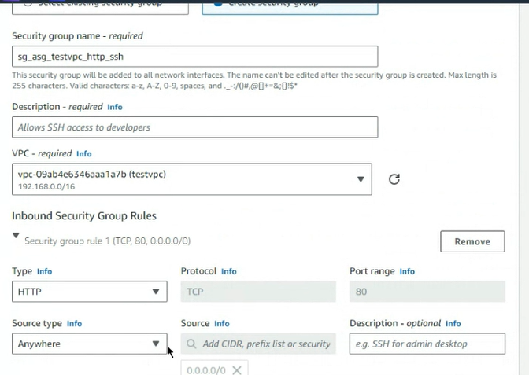
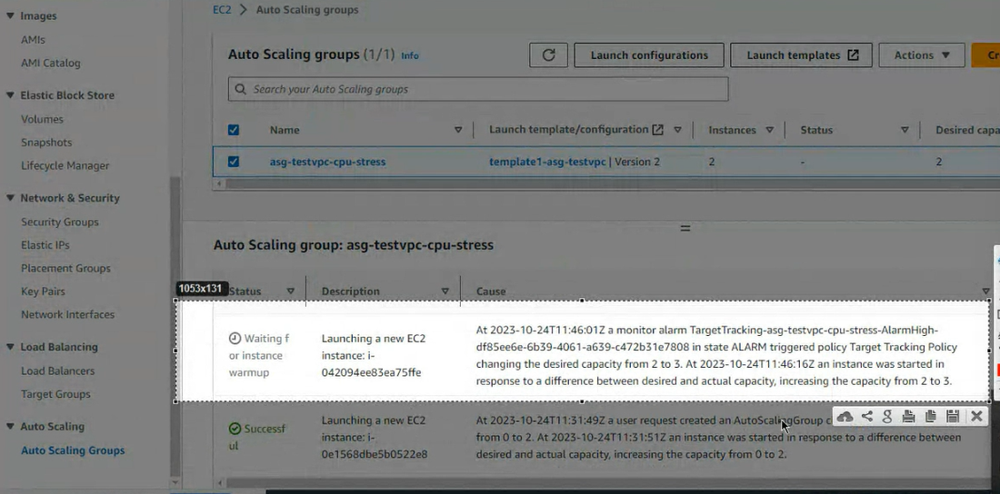
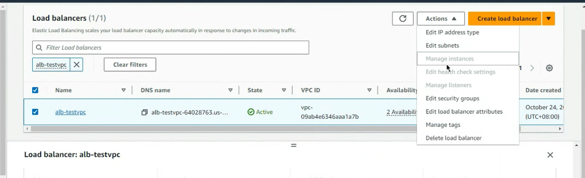

**Auto** scaling Group(ASG)

Elastic load balance(ELB)
我們要了解每個服務要使用在什麼樣的場合

在一些特定的節日會辦一些活動，我們需要調配伺服器的容量?多的時候擴張，少的時候縮減

當客戶多的時候可以採取兩種策略，一種叫做
Vertical
另一種叫做Horizontal

vertical是把cpu的效能，記憶體數量...進行擴充

Horizontal就是擴充伺服器
我們可以根據自己的場景來選擇

但也可以使用aws提供的ASG來自動擴充，當指標超過我們設定的臨界值，他就會觸發。

這樣可以避免花費不必要的費用
等等我們會用ASG來做三個實驗，其中一個會跟負載均衡器一起做。

雲端就是要提供一種穩定可靠的服務給消費者，如果我開了兩台機器，一台機器慘生了故障，如果我有使用ASG他就會幫我們維持在一個基本的門檻，這樣就直接的提供了我們的伺服器可靠度。

我們要做的第一個實驗就是這個

先到EC2

TESTVPC有PUBLIC PUBLIC2 跟 PRIVATE

資料庫今天大概用不到

一開始我們會將兩個SUBNET連在一起形成ASG，PUBLIC裡面慧放EC2虛擬機，我們要讓他最少維持兩台最多擁有四台虛擬機。

ASG可以方擬維持最基本的服務機器數量

  

先選EC2
  

再選AUTO SCALING GROUP

  

編輯名稱

我們可以使用模板來建置機器
但現在沒有所以我們必須要創建一個模板
  

  

描述可以寫可以不寫

  

也可以使用自己的ami

  

T2.MICRO

KEY PAIR 也選好
SUBNET可以先不配

建立SECURITY GROUP
  

增加規則:
http -> anywhere
  


subnet先不用選

  

user data
```shell
#!/bin/bash
yum update -y
yum install -y httpd.x86_64
systemctl start httpd.service
systemctl enable httpd.service
echo “Hello World from $(hostname -f)” > /var/www/html/index.html
```

我們就可以launch template
老師因為名字問題所以重新更換名稱，如果我們沒有問題就不用動他，
 

  

  

我們開始選擇網路
  

testvpc 1a 跟 1c
按下Next
  

  
預設值

Next
  

setting min and max

next....
看到這個頁面
  

按下去
  

設定好的樣子

假如我們關掉一台機器
  

到asg

可以看到log
  

觸發min事件
他需要再創建一台虛擬機
  

新產生的ec2
  

並且會使用你剛剛設定的模板來配置虛擬機

## 做完抓兩張圖
一張事件的，一張新增的圖(ec2)


到ec2
Launch Template
  

選擇modify

create_security_group 
  

增加ssh的功能

  

  
> create template

開始回到asg
先把上個asg delete
  

create new template (Auto scaling groups)

  

  
> version記得改成2

  

選1a 1c 因為1b是後端資料庫

不要有loadbalance

grace period 增加觀察時間，避免一到設定點就直接新增虛擬機

  

Next

min :2
max :4

  

Next
Next
Next
Create
  

測試一下虛擬機可不可以跑
  

增加CPU的負載
使用人工增加CPU負載
先開啟虛擬機連接到Ec2

免費的方案五分鐘才能獲取觀測值

可以縮短到一分鐘但是需要付費

  

安裝stress
  

  

用於提升cpu的負載

  

可以調整觀測時間
  

asg預設是5分鐘才有反應

也可以透過asg來觀測
  

  

  
> 新增了一台虛擬機來處理負荷

instance就會有三台在running

cpu還是負載...所以他又新增了一台，4台虛擬機
  

## 抓一下4台虛擬機的圖

  
> delete auto scaling group


接下來要說load balance

launch先不要delete掉 因為還有第三個實驗
負載均衡器

我們需要創建一個target group
ec2-1 ec2-2變成一個group
elb連接到target group
當客戶進來的時候就可以連接到elb
elb就會把我們的請求送到target group的
虛擬機上面(自動分流)

  

首先產生兩台ec2
  

www1 跟 www2 (subnet要調整)

  
(可加可不加)

  

  

user Data填一下

再創建第二台instance


```shell
#!/bin/bash
yum update -y
yum install -y httpd.x86_64
systemctl start httpd.service
systemctl enable httpd.service
echo “Hello World from $(hostname -f)” > /var/www/html/index.html
```

第二台虛擬機要改一下subnet 選擇1c
  


  


  

  

  

  

  

  

要按Include

才會形成
  

  

產生我們的負載均衡器

  

Create Load Balancers

  

今天用的是Application Load Balancer

  

  

  

testvpc 選擇1a 1c

  


security group
 

  

  


  

無痕模式會模擬一般使用者連進去的方式，如果不使用無痕，會被瀏覽器記住

  

## 截一張圖

Delete load balancer
  

Target group

  

關閉instance

  

template不用管


