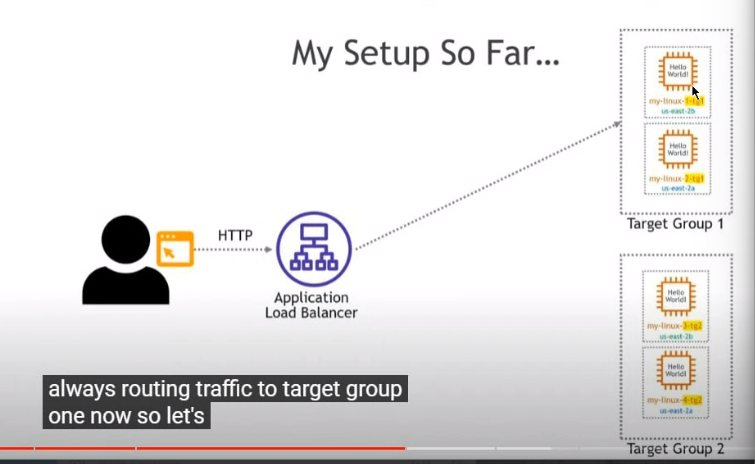
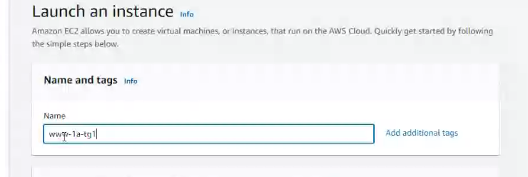
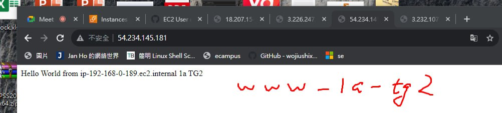
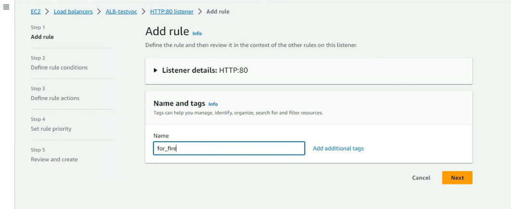
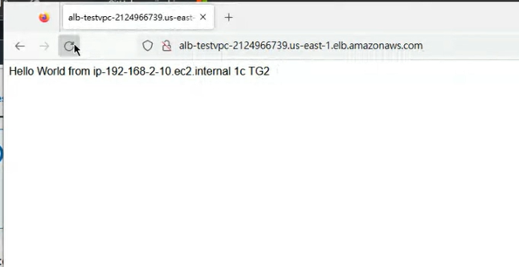
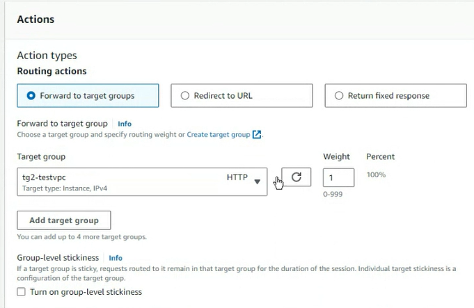

我們上周做了負載均衡
db使用的是maria db
之後我們會介紹到 rds 他是server less的服務

做這個行業最重要的事情就是要了解整體的架構

  

手動安裝手動配置如果要更新都需要手動的去更新，但是aws提供了server less的服務

db 分成 relational database
跟 serverless的服務你不需要手動的去配置他，
希望我們可以手動的一步一步安裝，提升整體的架構了解，但之後可以使用他的server less服務

透過elb 連接到我們的伺服器
  

target group可以有很多個，可以在elb做設定，並把某些東西導向target group 分配到不同的group下，可以透過url配置，有些連接到target group1 有些連到2

有些是圖片有些是影片，伺服期提供不同的服務，使效能能夠變得更好

下禮拜要把前面幾周的東西再做一次
做一個vpc 開兩個public subnet
  

第十週會把架構做延伸，會接觸到Elastic cache
可以達到edge computing ，如果沒有資料就從總機抓資料，並且儲存再當地，下次有人使用的時候就可以直接從cache裡面獲取此數據

Cloudfront:Http 的服務很不安全透過cloudfront就可以得到https
(外部)，內部可以使用http 因為需要網域所以需要申請

S3(儲存桶)
希望我們能夠了解一個商業網站需要使用到的功能

  

taget group1
target group2
  

一個target group有兩台機器

根據http header表頭來進行分配
裡面有user-agent
user-agent紀錄著使用的瀏覽器
如果使用ie 就分流到 target1
chrome就到 2.....

  

http再進行網頁的存取的時候可以使用get 或是post的方式來獲取資訊
根據不同的key來分配不同的group
  

根據後面的標籤導向不同的區域網站
  

開四台虛擬機
testvpc 裡面有 public1 他在a區
public2與1裡面都有ec2

把裡面的機器設定程target1 再開兩台設定維tg2

elb連接到tg1 tg2
  

User data
```sh
#!/bin/bash

########################################
##### USE THIS WITH AMAZON LINUX 2 #####
########################################

# get admin privileges
sudo su

# install httpd (Linux 2 version)
yum update -y
yum install -y httpd.x86_64
systemctl start httpd.service
systemctl enable httpd.service
echo "Hello World from $(hostname -f)" > /var/www/html/index.html

```

  

  

  

  

  

  

  

產生第二台
  

  

  

  

  


第三台
  

1a tg2

  

第一個Public第二個public2


  

  

以上就是重複的動作

只是修改了 target名稱跟public

  


  

## 四個都做完就隨便貼一張圖就好了

選擇 target group

選擇instance
之後輸入target group的名稱

tg1-testvpc
  

ipv4 http

  


  

tg2 ->testvpc

  

  

create new load balancer

選擇 Application Load balancer
  


  

  

1a 1c
還有testvpc public 1 跟 2

  

先選擇tg1
  

等待
  


接者就等他部屬一下
輸入網址
  

發現loadbalance成功

先做到這裡

  

target group 還有一個沒有associate

## 做完就抓一下負載均衡器連接的情況

接下來要連接tg2
  

  

選擇 Listeners and rules
  

  

Edit rules

勾選Default
  

edit rules
  


  

  

  

可以更改 Weight來進行調整

  

按下Save

You will see
  

let we get a test
你可以看到tg1跟tg2都可以連接到

## 做完了就把圖抓一下
這樣代表每一台主機都有25%的機率使用到

把instance close 擬將不會連接到那台虛擬機

analilyze will filter instance that you close
so you will not saw  closed instance

到load balancer

edit rules
  

remove tg2 -> save

  

tg1 100%

we want add another rule, so please change your rule like above picture


In load banacer page
click your ALB-testvpc

In here click Rules columns's 1rule
  


  

if you using google chrome using tg1 using firefox using tg2
we want to implement this method

Name: for firefox
  

  

You need to modify Add condition

  


  

select target group 2

  

select next

then you will see...

  

如果使用firefox就會導入到對應的target group

If using chrome you always use tg1
  

You need to dowload firefox for test if you not already had

using firefox website source always from tg2
  

if you want to see website header you can follow below picture
  

select Network -> file /

  

In the user Agent had firefox keyword.
Easy for loadbalancer determent flow direction


## 抓一下firefox的視窗，顯示的是tg2

我們還可以新增規則
  

  

  

  

  

  

  

  

Priority 設置成2,剛剛for firefox為1

這樣有value=100的參數時, 就會導向到tg2-testvpc

雖然我們使用的是Chrome但他也會導向到tg2

  


  

  

路徑包含這些就讓她沒辦法進去
  

說明這是不能訪問的網頁

優先順序設置成3

建立規則

  

  

  

## 找時間再測試


tg 跟 alb是可以整合在一起的

假設cpu過載又能再產生一台ec2

這就是跟 auto scaling組合再一起的結果

  


所有東西刪掉(之前的東西都已經做好的話)

Load balance
Target group

auto scaling group

create auto scaling group
  

使用之前的模板
  

Next

testvpc

1a 1c

  

  

創建一個新的負載均衡器

  

更改名稱

  

  

create a target group

  

Next

兩台虛擬機
最小2
最大4

  

  

  

進行測試複製load balancer 的網址

如果向上次一樣加附載給虛擬機，他就會再新增一台虛擬機


今天完成的功能

  


