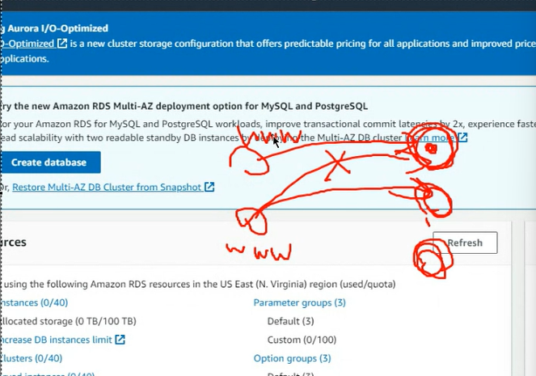
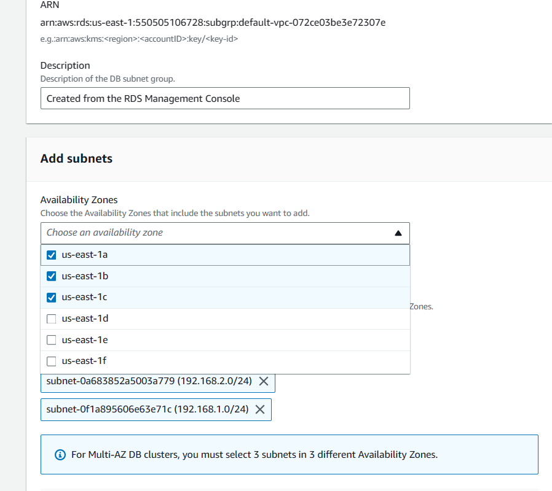
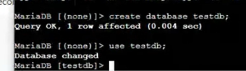
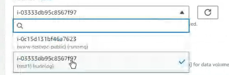

# ServerLess Service
RDS : Relational Data Service

關係型資料庫的服務

之前建立資料庫設定MariaDB在EC2做使用，需要做很多配置，但是更新的時候可能又要維護很多地方，傳統維護這些資料庫需要有很多人力去處理，但是現在AWS提供了資料庫的服務給你，硬碟不夠大，內存不夠多???你不需要CARE，你只要會使用就好，這就是Serverless的強大，AWS提供了Mysql, MariaDB, aurora

之前在期中考之前講的是比較初階的東西，現在開始要進入到比較進階的階段，

以下是我們的教學順序
RDS EBS EFS EIP IAB
(NOSQL的部分)

  

EBS -> Elastic block service

把虛擬機terminate的時候想要保留，就可以使用到EBS的服務

EBS可以把資料掛載上去

EFS -> Elastic File system
當今天有多個ec2想要共享資料的時候就可以用到EFS,很像NFS

EIP 
申請一個公有IP，可以放置到一台EC2上，不會因為開機關機而導致IP的變動

Terraform就像是使用指令控制虛擬機的創建或修改

先點RDS
  

創造的過程當中，剛開始都是0也就是沒有使用到服務
  
如果沒有變成0就會收錢，代表你有在使用某些服務


先來說說Account
  

在最下面，如果這學期以後不會再使用到aws

  

有銷毀帳號的功能(怕被盜，還是服務政策改變就會收費)

好..先到RDS

  

我們盡量使用免費的功能
自動備份:如果資料庫掛掉了，可以讓另外一台虛擬機做使用

如果www都在同一台資料庫去讀取資料，會造成效能的降低，如果使用資料庫的copy功能就可以改善效能

  

企業的角度他不會在意"錢"的部分，比較在意的是穩定度跟robust

建立資料庫:
  

標準創建
  

選擇資料庫

aurora是aws自己客製化的資料庫，效能超絕，只是要多付錢

我們使用MariaDB
  

版本
  

Templates
  

商業環境可能使用前兩種，

資料庫名稱:
  

登入的時候給他什麼樣的帳號
  

  

密碼12345678

  

  

儲存空間不夠的時候他會幫你擴展

免費版不能挑資料庫放置區域
  

(容錯性就會比較不好)

  

選擇testvpc
  

資料庫不對外
  

選擇security group
  

如果這個時候你沒有看到private_ssh_mysql有可能是因為你之前有刪掉sg，要再重新創建一個security group

3306 port open
  

  

這個時候你可能會沒有看到1b的選項，千萬不要慌張，非常有可能是因為你的subnet是後面創建的，所以他預設是沒有1b的，你需要進行更改!!

  

你可以看到左邊有導航欄
選擇subnet group
  

勾選defaultvpc
  

  
Edit

看到Avaliability Zones這邊
  

勾選1b

Subnet也勾選

之後點選儲存
  

會到創建RDS的介面


放在1b的環境下
  

預計花費

密碼要八個字元
  

接著建立資料庫

  

等待他去建置

啟動網頁伺服器的機器
  

創建好了之後你點到資料庫當中
  

  

endpoint跟3306


先測試可不可以連接資料庫
  

  

## 貼一張連接到database的圖片

看看EC2的3306有沒有被開放
  


  

```
create database testdb;

use testdb;


```

  

```
create table addrbook(name varchar(50) not null, phone char(10));

insert into addrbook(name, phone) values ("tom", "0912123456");

insert into addrbook(name, phone) values("tom", "0912123456");
```

切換到 html目錄
  
```
cd index.php testrds.php
```

先切換到超級使用者
  

修改裡面的內容

Servername改成 rds-> database的endpoint
密碼也要改
還有資料庫的名稱

  

資料庫是addrbook
  
儲存

```
<?php
$servername="testdb.cogqz7vlsnqe.us-east-1.rds.amazonaws.com";
$username="user";
$password="12345678";
$dbname="testdb";

$conn = new mysqli($servername, $username, $password, $dbname);

if($conn->connect_error){
    die("connection failed: " . $conn->connect_error);
}
else{
    echo "connect OK!" . "<br>";
}

$sql="select name,phone from addrbook";
$result=$conn->query($sql);

if($result->num_rows>0){
    while($row=$result->fetch_assoc()){
        echo "name: " . $row["name"] . "\tphone: " . $row["phone"] . "<br>";
    }
} else {
    echo "0 record";
}
?>

```

回到我們的ec2
連接到虛擬機
  

## 貼上網頁的內容
已經成功的連接到資料庫

使用RDS就不用考慮安裝跟維護資料庫的事情

  


Delete testdb instance
怕你反悔
Create final snapshot
Retain automated backups
拿掉

下面那個打勾
  

  

說明資料會不見並且我沒有異議

按下Delete


等等我們要介紹EBS(在EC2的頁面)
EBS防止terminate資料不見的問題

選項欄有

  

選擇Volumes

我們Create 一個Volumes
  

綁定可用區
  

快照(需要付錢)
安全性會比較好
  

給他一個tag
  

Create volume

我們可以先創建ec2或著用之前的ec2

  

選擇剛剛創建的Volume
選擇Attach volume

選擇我們運行的Instance
  

Device name使用預設值
之後點擊Attach volume

Connect 我們的Instance
  

  

  
> Attach成功的話lsblk可以看到這些內容

  
> 這個裝置是用來儲存資料用的

 

```
mkfs -t xfs /dev/xvdf
```

  
```
yum install xfsprogs
```

  
> 建立Data的資料夾

```
sudo mkdir /data
```

掛載資料夾
  

```
mount /dev/xvdf /data
```

  

在data資料夾當中產生10個檔案
  

探討創建的檔案是否能夠看得到
  

先把掛載點拿掉
輸入lsblk可以看到data不見了

```
umount /data
# 如果出現 /data is bussy 說明你可能在資料夾當中你需要cd..

lsblk
```
  
> 可以看到他沒有掛載到/data資料夾下了

強制移除testEBS volume
  


我們剛剛把資料裝到虛擬機當中，現在又把他移除

  

可以看到輸入lsblk時，那顆虛擬硬碟已經不見了

Create a new instance
  


  


  

  

  

1a的環境

  

  

  

建立虛擬機

回到Volume
Attach我們剛剛的EBS

  

選擇我們的instance
  

Attach

Connect ours instance
  

  

setting password
  

password: root

  

mkfs不要再format了，不然資料會不見

make a directory
  

```
sudo passwd root
# root
mkdir /data
mount /dev/xvdf /data
```

  

## 抓第二張圖可以讀取到EBS的內容

  

先Delete第二台虛擬機
之後再刪除掉Volume
  

Spot Requests
雲端會有閒置的資源，我可以使用一些比較少的錢去跟別人競爭，看可不可以拿到一些虛擬機

我可以提出預算:每小時3美金
有資源，且我出價最高，那麼AWS可以提供虛擬機給我，但是資源不夠或別人出價比我高的時候，虛擬機就會被拿走

用途:平行運算

我現在只有這些錢，但是我想要獲得這種服務(比較省錢的一種方式)

### Dedicated Hosts:
> 虛擬機要跑在哪一台真實的機器上???

效能是最好的，但是你要花最多的錢

### Savings Plans
> 未來可能會使用到多少虛擬機，跟他簽定一個合約，確保他會提供給你資源，會有一定的折扣

### ElasticIPs
> 幫你產生一個固定的IP，讓你可以配置到虛擬機上面

  

到ElasticIP
選擇region
  

IPV4 address
  

allocate

  

現在沒有配置Elastic IP
  

配置:
  

  
> 選擇www這台機器

associate

stop instance
  

reopen

如果你架一個網站，需要固定IP就需要ElasticIPs

  

假設我們的instance壞掉了，他會再重新把IP配置到另一台instance上。
(可以使用複製的不然資料可能不一樣)

創建一台www2 配置跟剛剛依樣

先到Elastic IP取消連線
  

之後再associate

換成www2
  

www2 的IP也變成`35.170.151.131`


  

Elastic IP 是可以遷移的

release我們的Elastic IP
  

不然會被扣錢

下禮拜會說IAM 跟EFS


