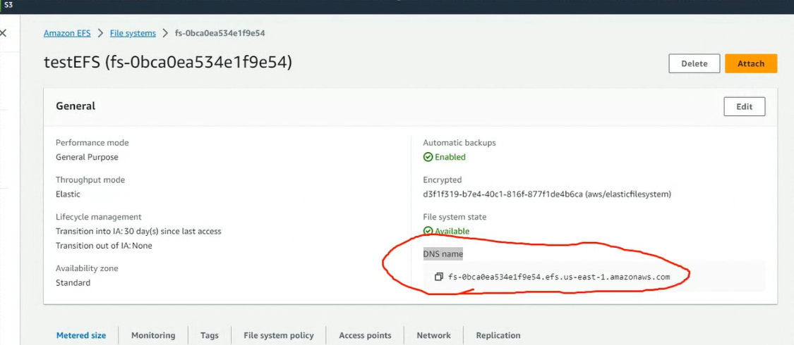
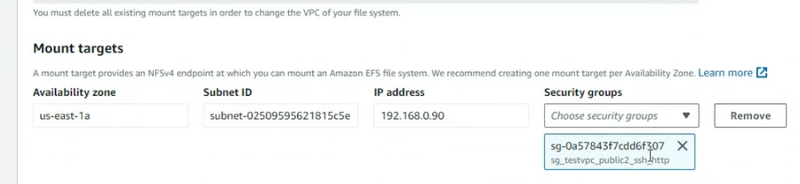

EFS

先簡單的複習一下EBS，如果你有一台ec2的機器,把機器attach到EBS之後終結資料還會存在。

今天要介紹的是EFS
EFS可以掛載到EC2上面，他們可以共用EFS，作用就是可以讓EC2使用相同的資源(資料)
  

EC2可以是在不同的分區

EBS與EFS的差異
  

  
> 先點選EFS

  

  

  
> testvpc

  

>點擊File system ID那個超連結(剛剛所創建EFS的)

  
> 可以看到有DNS name 這是連接他的方式

  

產生新的EC2
一台放在1a一台放在1c

create new ec2
  

  

testvpc
  

挑一個支援ssh跟http
  

  

  

  

  

  

create

  
> 擁有兩台機器

  
> EFS涵蓋的範圍(Network選項)

  


需要建立access point
  

  

選擇剛剛的EFS
  

  

其他是選擇項(可以不用輸入)，之後create

  


```
Link:https://docs.aws.amazon.com/zh_tw/efs/latest/ug/wt1-test.html
```

connect 1a and 1c
  


1a
  

  

已經自動裝好nfs了

他會給你一個DNS

  

  
> Domain name

先建立連接的資料夾
  

兩台虛擬機都需要建立

這個實驗先放著
(實驗過程會在下方)

現在要講的是IAM
  

  

我們註冊時使用的是管理者的權限，但最好是使用使用者權限來使用aws，否則管理者權限太大甚麼都可以動，最好特別區分，ex:database, web, backend, ai

  

* IAM 是全球的服務，使用者名稱只能是獨特的
* Root account是很重要的，最好不要使用，或是分享出去
* 公司可能Developers 跟 Operations分開
* 每個使用者可以在多個群組當中

IAM 的功能表
  

## Permission
  

你現在不會寫沒關西但是最好要看得懂

**這個人會做甚麼事你給他對應的權限就好其他的權限就不要給他**

繼承
  


可以給描述檔一個ID
  

- sid: 身分
- Effect: 允許
- Resource: 資源
- Action: 動作

Role 角色
在AWS裡面會有很多資源，虛擬機如果想要存取其他資源的時候，會有權限的問題，
assign permission

  

Management Console
圖形化的介面不是那麼好管理，自動化，使用CLI可以解決這個問題，CLI就是 Command Line interface

我們會有Access key and Secret key

  
> 直接把檔案備份到雲端硬碟

SDK: 管理或維護的時候可以使用各種語言整合到程式當中，有了SDK就可以對產品做成二次包裝，客製化成你想要的樣子，讓管理跟維護更加方便。
  

先到IAM的頁面
點擊User

  
> IAM Create a account

  

  
> Provide user access

上圖如果要使用到CLI就不用勾，如果想要有圖形化界面的話，就需要打勾

  

我們改用下面的方式
  

  

  

密碼需要特殊字符
  

創建使用者

  

設定permissions
  

我們使用attach

如果是管理者就選擇
  

先把他打開選擇next

創建使用者
  

  

使用者有被創建出來

ARN 是識別碼 :user/tom 代表  tom是user

如果使用CLI 就會有Accesskey

切換dashboard

  

複製url
  


登出
  


輸入剛才的url(貼到瀏覽器上面)
  

輸入帳密(tom)

  
> 成功登入tom的帳號

我們給Tom一個很高的權限，但不代表所有的權限都給他

  
> 像現在就不能查看帳單

## 貼一張不能看帳單的圖片

到Elastic File system 刪除access point
  
File System也刪除

  

  

delete ec2
  

剛剛遇到沒有辦法解析的問題

  

  

  
> 剛剛沒有勾所以沒辦法解析DomainName

打勾之後save

重新創造Instance

  

  

  

  

  

Launch instance

go back to efs
  

create a new file system

access point
  

create

go back to file system
  

  

  

```
Execute the following commands on the EC2 instance by using the SSH session:

(Optional) Get updates and reboot.


$  sudo yum -y update  
$  sudo reboot  
After the reboot, reconnect to your EC2 instance.

Install the NFS client.


$ sudo yum -y install nfs-utils
```

  
```
mkdir ~/efs-mount-point 
```

  

複製EFS的DNS name

```
sudo yum install -y amazon-efs-utils
```

  

```
The EC2 instance can resolve the mount target DNS name to the IP address. You can optionally specify the IP address of the mount target directly.


$ sudo mount -t nfs -o nfsvers=4.1,rsize=1048576,wsize=1048576,hard,timeo=600,retrans=2,noresvport mount-target-ip:/  ~/efs-mount-point
```
  

can open one more VM

  

>region public2

假如卡在一個地方，點進去那台虛擬機(點Instance ID)

  

  

  

點擊security group
  

  

  
> add nfs(anywhere)

切換到Elastic File System
  

點擊Manage

  

  
> 選擇sg_testvpc_public2_ssh_http

因為他有開啟NFS權限

三個都需要更改
  


```
cd efs-mount-point/
```
  

  

Create abc file 

switch to another instance
connect to this instance
but connect failed so...

recreate a instance 

  

  

In another instance:
  

create  a mount dir
```
mkdir ~/efs-mount-point
```
  

> target 換掉

```
sudo mount -t nfs -o nfsvers=4.1,rsize=1048576,wsize=1048576,hard,timeo=600,retrans=2,noresvport mount-target-ip:/  ~/efs-mount-point
```

  


(可以等兩個虛擬機都創建好以及連接好EFS再創建檔案??)
可以看到有abc
  
> 產生新的檔案

  
> 其他機器也看得到

筆記要做一下，不然會常常忘記??
  
> 這個resolution很重要

  
> 還有sg很重要

  

```
導 班, [2023/11/21 下午 08:17]
1. VPC—>enable DNS resoultion

導 班, [2023/11/21 下午 08:18]
2.EFS  建立file system   3. 建立Access Point

導 班, [2023/11/21 下午 08:18]
4.修改一個security group,把NFS規則加上

導 班, [2023/11/21 下午 08:18]
5.修改EFS中的EFS

導 班, [2023/11/21 下午 08:18]
6.建立兩台EC2

導 班, [2023/11/21 下午 08:19]
在EC2上,sudo yum install -y amazon-efs-utils

導 班, [2023/11/21 下午 08:19]
mkdir ~/efs-mount-point

導 班, [2023/11/21 下午 08:19]
sudo mount -t nfs -o nfsvers=4.1,rsize=1048576,wsize=1048576,hard,timeo=600,retrans=2,noresvport mount-target-DNS:/   ~/efs-mount-point

#dns的位置要更改
```


