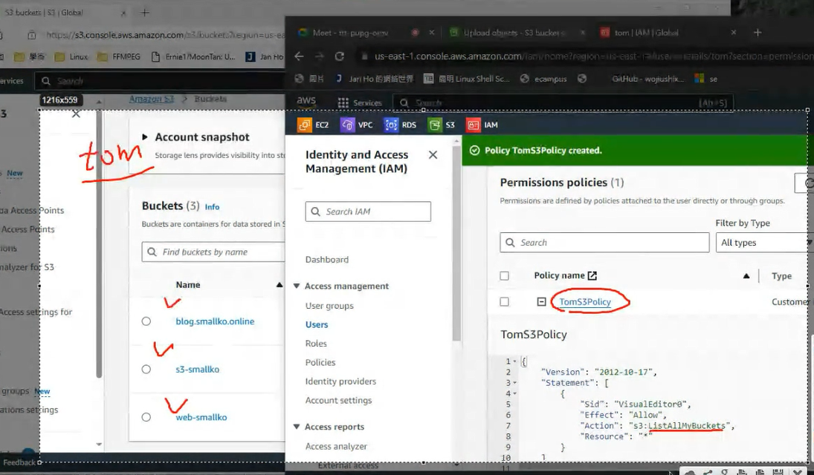
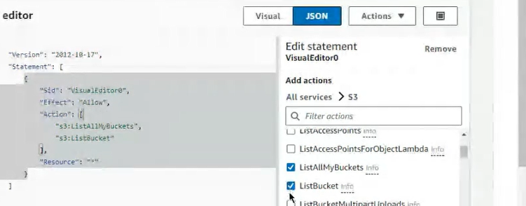

sign in
這是老師提供的AWS 自學網，裡面有包含AWS的操作及衣些機器學習在cloud的使用，有興趣的可以自行參考(很多免費課程，不需要再去Udemy花錢)
  

  

> https://explore.skillbuilder.aws/learn/home

  


  

  

帳單

  

  

  


下面有統計一些花費
  

NAT EBS???都會花錢

S3 跟IAM 是今天的課程
先來說明S3

  

  

For store some thing?
this is global service

buckets <- store file

  

global only(only one name)

  

  

bucket policy can setting who can access(read/store) file

IAM <- According user define permission

  

specfic 3:
- user : according people
- role : instace??
- acl

  

  

> public or not?? *((not))

  

if we had test.txt content are aaa,update to bucket,then we change the test.txt to bbb, it will record aaa and bbb version
(disable cant save multiple version)

  
> default

  
> success create

  
> update object(teacher using small picture)

drag to browser
then draw a 1.txt

choice upload
  


  
> you can click 1.png

  
> You can using this url

this url is identify id so your name must only

  
> but cant access because you setting not public

If you want to check(saw the picture)

  
> You can click open button

  

  

  
> 取消打勾

  

Enter url also cant access file....

  

  
> In permission

  
> Search Example

  
> You need change the format

  

> You need copy your arn to plaece Resourse address (except /*)
```
{
    "Version": "2012-10-17",
    "Statement": [
        {
            "Sid": "PublicReadGetObject",
            "Effect": "Allow",
            "Principal": "*",
            "Action": "s3:GetObject",
            "Resource": "arn:aws:s3:::blog.smallko.online/*"
        }
    ]
}

```

Save

  


  

enter url

Then you can access file

# Post a picture like this 
  

## Delete
  

1. Empty the bucket

  

  

  
> successful delete bucket

Bucket seems need to pay

  
> recreated

  

  
 
  


  
> update

  
> change content

drag

  

change to ccc

drag
upload
  

  

  

  

you can delete version
  

  

content: bbb

If bucket in diffent region
how to auto assign data to every bucket?
  

  

  

 create

   

  

create

  

  

create replication rules
  

  

  
> all object replication

  
> select target

Need using user when you copy file

  


Save

Without pay when you select no
  

back to source
  

  
> upload object

we update 3 files

  

wait a moment you can see target also had file, it is as same as source

  

## Post target had synchronization file

you can save one bucket and delete another bucket(if you want, it can avoid excessive synchronization)

We choice save source bucket

Now you can create a new word file
  

and paste a picture
  

save as 
  

  

create
  

and edit it
  


  
> create bucket

  


  

create bucket

  

upload
  

Permission
  

```
{
    "Version": "2012-10-17",
    "Statement": [
        {
            "Sid": "PublicReadGetObject",
            "Effect": "Allow",
            "Principal": "*",
            "Action": "s3:GetObject",
            "Resource": "arn:aws:s3:::blog.smallko.online/*"
        }
    ]
}

```

  

  

  

  

  

Save changes

  

  

## Post your website snapshot

IAM
  
> paste url (signout first)


  
Password: tom1234!
using another browser
(firefox)

remove tom's permission
  

  

  

administrator create tom's permission
  

  
> choice s3


  

Click list

  

  

tick ListAllMyBuckets

**Resources**
  

Next

  

Create Policy
  

  
> expansion

using tom's browser can saw total bucket
  

## paste picture like  this
  

修改tom的權限

選擇Edit
  

選擇S3
  

  
> 打勾ListBucket

  

按下Next > save
回到tom > 重新整理
就可以看到1.txt(或者你上傳的東西了)

但是現在只可以看到並不能讀取

因此我們再
  

  

加入GetObject權限
Save 
Tom就可以看到檔案的內容了

  

  

但不能上傳(沒有權限)
  

新增PutObject就可以擁有上傳的功能
  

對某個bucket有特定的功能可以這樣這定
  
 
  
> 針對某個Resource有特定的功能(這邊是上傳)
>

一個bucket可以讓Tom上傳資料另一個則不行

  

  
arn 在s3的
  

```
{
	"Version": "2012-10-17",
	"Statement": [
		{
			"Sid": "VisualEditor0",
			"Effect": "Allow",
			"Action": [
				"s3:ListAllMyBuckets",
				"s3:ListBucket",
				"s3:GetObject"

			],
			"Resource": "*"
		},
		{
			"Sid": "VisualEditor1",
			"Effect": "Allow",
			"Action": [
				"s3:ListAllMyBuckets",
				"s3:ListBucket",
				"s3:GetObject",
				"s3:PutObject"
			],
			"Resource": "arn:aws:s3:::source-wang/*"
		}
	]
}
```


## Po 一張可以上傳衣章不可以上傳的圖片
  


在IAM 裡面還有一個ROLES
  

Role是針對AWS的服務，可以把權限賦予Instance讓他可以傳入資料給S3 之類的...

  

  

  

> Next

  

  

> ec2使用這個Roles就可以 操作S3

  

  

  

/>>>> create roles

選擇instance
  

> 有一個Modify IAM Role

挑一下我們剛剛創建的Role
  

回到虛擬機，現在已經可以列出S3的pcket了
  


  
> 創建一個檔案copy到S3上面


