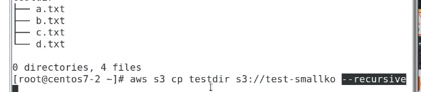
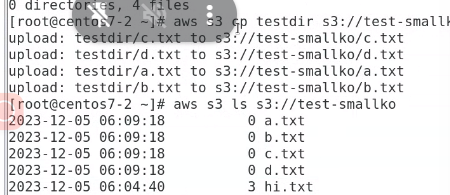

今天要說的是IAM的部分，上次說的是Role的部分，可以把Role複在EC2上

role 是針對resource,也有針對使用者的功能。

常使用的方式有
- web
- cli
- sdk

這邊有針對
- Linux
- Windows
- MAC OS
  
的版本
>  
教學 https://docs.aws.amazon.com/zh_tw/cli/latest/userguide/getting-started-install.html

  

切換到超級使用者把它安裝起來

### 貼一下連接成功的圖

我們需要access key 跟 secret key

一開始是不會創建出來的，我們要自己創建(Key需要認真地記起來，)

使用TOM
  

先Add permision
  
> 選擇attach policies

  

IAM -> User -> tom
給他管理員權限，把S3那個權限刪除

  

這邊可以Create access key

  

下面有一個打勾選項記得要勾 -> Next

把你的key記起來
  

另一種方式就是把它下載下來
  

現在要配置
  

他會問你密碼
  

  

理論上就可以連接到s3了
## 貼一下成功顯示s3內容的圖片

剛剛做完aws configure完可以看到
  
> accessKey 跟 private key

現在要說的是CLI的基本操作

使用command Line建立bucket
  

web 應該也可以看到你新建的bucket

可以使用 `aws s3 ls`的方式顯現出來

可以做:
  
> 創建hi.txt 傳送到 s3 裡面(好像不行，所以使用copy的方式)

  

假如我們在windows創建了 a.txt
裡面內容是aaa

手動上傳到bucket裡面
(使用web)

之後到linux
使用 aws copy 到本地端(Linux)
  

今天建立了一個資料夾嫁作testdir 並且產生檔案
  

  

我們想要把他們都輩分到雲端上

  
> recursive 遞迴 會把資料夾當中的所有東西都被分到s3上面

  
> 上傳的時候會把資料都copy上去，卻沒有建立資料夾(而在s3的跟目錄)

如果想要把資料夾也上船上去
  
> 你網址當中也要有資料夾的名稱

如果要改名字

首先裡面有a.txt
我們想要改成....
  
> 使用mv指令改成aa.txt

如果想要刪除的話就使用`rm`
  

如果要刪除bucket 使用的是`rb`
  
> 但是要先把bucket變成empty

把所有東西都刪除:
  

就可以把bucket刪除了
  

