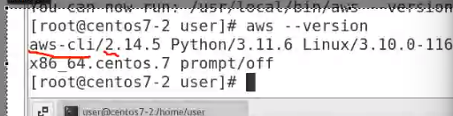
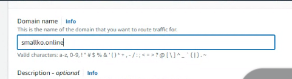
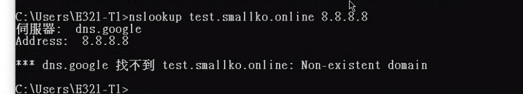
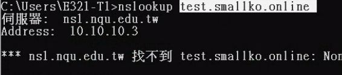
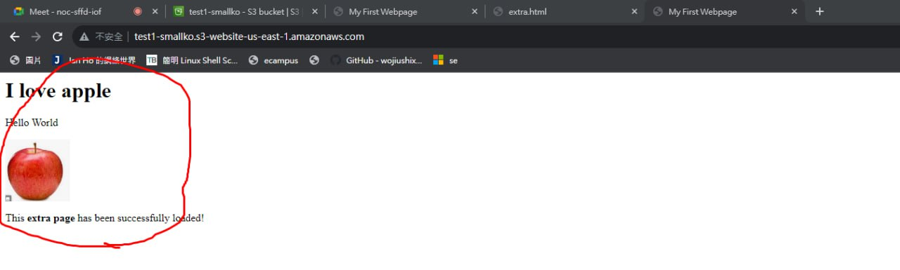

今天要說的是IAM的部分，上次說的是Role的部分，可以把Role複在EC2上

role 是針對resource,也有針對使用者的功能。


常使用的方式有
- web
- cli
- sdk

這邊有針對
- Linux
- Windows
- MAC OS
  
的版本
>  
教學 https://docs.aws.amazon.com/zh_tw/cli/latest/userguide/getting-started-install.html

  

切換到超級使用者把它安裝起來

### 貼一下連接成功的圖


我們需要access key 跟 secret key

一開始是不會創建出來的，我們要自己創建(Key需要認真地記起來，)

使用TOM
  

先Add permision
  
> 選擇attach policies

  

IAM -> User -> tom
給他管理員權限，把S3那個權限刪除

  

這邊可以Create access key

  

  


下面有一個打勾選項記得要勾 -> Next

把你的key記起來
  

另一種方式就是把它下載下來
  

現在要配置
  

他會問你密碼
  

  

輸入`aws s3 ls`
理論上就可以連接到s3了
  

## 貼一下成功顯示s3內容的圖片

剛剛做完aws configure完可以看到
  
> accessKey 跟 private key

現在要說的是CLI的基本操作

使用command Line建立bucket
```
aws s3 mb s3://test-wang 
```
要記住s3的name是要唯一的，**如果失敗有可能就是已經有人使用這個名稱**
  

web 應該也可以看到你新建的bucket

可以使用 `aws s3 ls`的方式顯現出來

可以做:
  
> 創建hi.txt 傳送到 s3 裡面(好像不行，所以使用copy的方式)

```
aws s3 mb s3://test-wang12
```
我的s3 名稱是wang12

  

假如我們在windows創建了 a.txt
裡面內容是aaa

手動上傳到bucket裡面
(使用web)

之後到linux
使用 aws copy 到本地端(Linux)
  

今天建立了一個資料夾嫁作testdir 並且產生檔案
  

  

我們想要把他們都備份到雲端上
```
aws s3 cp testdir s3://test-wang12/testdir --recursive
```
你要先回到testdir上一層目錄再輸入此指令

 

如果想要把資料夾也上傳上去
  
> 你網址當中也要有資料夾的名稱
> - recursive 遞迴 會把資料夾當中的所有東西都被分到s3上面

如果要改名字

首先裡面有a.txt
我們想要改成....

```
aws s3 mv s3://test-wang12/a.txt s3:://test-wang12/aa.txt
```
  
> 使用mv指令改成aa.txt

如果想要刪除的話就使用`rm`
  

如果要刪除bucket 使用的是`rb`
  
> 但是要先把bucket變成empty
```
aws s3 rm s3://test-wang12 --recursive
```
把所有東西都刪除:
  

```
aws s3 rb s3://test-wang12
```

就可以把bucket刪除了
  

這就是使用CLI的方式跟AWS 來互動的一種方式

OK先在我們的環境安裝python

``` sh
dnf install python3
# or
apt-get update
apt-get install python3

apt-get install python3-pip

pip install python3-boto3

# 如果不能就使用下面的步驟
# 如果有錯誤就使用 kill -9 [pid]
```


 

  


如果linux 版本太低會影響到 python下載的版本

`https://zhuanlan.zhihu.com/p/590965831`

```sh
# 先安裝epel release 有些套件才可以裝，沒有安裝ipenssl裝不起來
yum -y install epel-release
```

```sh
#此網頁的內容
cd /root
#只是将python3.11的安装包下载到 /root目录下
wget https://www.python.org/ftp/python/3.11.0/Python-3.11.0.tgz
#下载最新的软件安装包
tar -xzf Python-3.11.0.tgz
#解压缩安装包
yum -y install gcc zlib zlib-devel libffi libffi-devel
#安装源码编译需要的编译环境
yum install readline-devel
#可以解决后期出现的方向键、删除键乱码问题，这里提前避免。
yum install openssl-devel openssl11 openssl11-devel
#安装openssl11，后期的pip3安装网络相关模块需要用到ssl模块。
export CFLAGS=$(pkg-config --cflags openssl11)
export LDFLAGS=$(pkg-config --libs openssl11)
#设置编译FLAG，以便使用最新的openssl库
cd /root/Python-3.11.0
#进入刚解压缩的目录
./configure --prefix=/usr/python --with-ssl
#指定python3的安装目录为 /usr/python 并使用ssl模块，指定目录好处是
#后期删除此文件夹就可以完全删除软件了。
make
make install
#就是源码编译并安装了，时间会持续几分钟。
ln -s /usr/python/bin/python3 /usr/bin/python3
ln -s /usr/python/bin/pip3 /usr/bin/pip3
#指定链接，此后我们系统的任何地方输入python3就是我们安装的
#这个最新版python3了

#更新 pip： 確保您的 pip 版本是最新的。執行以下命令升級 pip：


python -m pip install --upgrade pip
# 安裝 OpenSSL 開發套件： 在某些系統上，需要安裝 OpenSSL 開發套件才能解決 SSL 問題。您可以使用系統特定的套件管理器（例如 apt、yum、brew）安裝 OpenSSL 開發套件。以下是一些示例命令：

#在 Ubuntu 上：

sudo apt-get install libssl-dev

#在 CentOS 上：
sudo yum install openssl-devel

pip3 install boto3
```
如果是python3.7以上的版本就不用做更新

```sh
touch test.py
```

```py

import boto3

s3 = boto3.resource("s3")

# 创建一个 bucket
bucket = s3.create_bucket(Bucket="my-bucket")
# my-bucket要根據你想要的s3名稱做更改

# 获得所有的 bucket, boto 会自动处理 API 的翻页等信息。
for bucket in s3.buckets.all():
    print(bucket.name)
```

可以新建一個python檔案來對以上內容做測試

所以現在要講的是SDK的部分
`Software Development Kit`


這是我們Code
用來顯示s3 bucket的內容

  

```
import boto3

s3 = boto3.resource("s3")

# 获得所有的 bucket, boto 会自动处理 API 的翻页等信息。
for bucket in s3.buckets.all():
    print(bucket.name)
```

如果之後會接觸到跟aws相關的程式撰寫我們就需要使用到`boto3`

更改版本
  

```py
import boto3
s3 = boto3.resource("s3")
bucket = s3.create_bucket(Bucket="mybucket-wang")

# get all bucket, boto will deal with api page information by automatic
for bucket in s3.buckets.all():
    print(bucket.name)

# generate a bucket resource
bucket = s3.Bucket("mybucket-wang")
print(bucket.name)
bucket.delete()
print("------------------------")
for bucket in s3.buckets.all():
    print(bucket.name)
```

Boto3建議使用python3.8之後的版本
  

(如果你要做的是運維工程師，那boto3基本不會碰到，但如果是軟體工程師的話就會用到了)

  

# 貼一張test3.py的圖片

接下來要說的是申請`Domain Name`的部分

> https://tw.godaddy.com/offers/godaddy?isc=sem1year&countryview=1&currencyType=TWD&cdtl=c_20012948307.g_146146597897.k_kwd-93455629.a_655882536885.d_c.ctv_g&bnb=b&gad_source=1&gclid=Cj0KCQiAsburBhCIARIsAExmsu4MMGMKBCDAJzCsNSPAeOYylK532biHh2vWVCb53cJxfQrrD1Gn60oaAoZXEALw_wcB

  
> 可以挑一個比較便宜的(這是一年份的)

點一下購物車
  
> 登入後付錢

  

申請完登入後儀表板應該可以看到你的DomainName
  

# 貼一張你申請好的Domain Name

  
> 續約與帳單可以把你綁定的VISA卡清除掉(如果之後不需要Domain Name功能的話)

  
> 可以把自動續約取消掉

做完可以先把EC2的虛擬機打開
  

啟動之後連接看看

  
> 現在是使用IP 的方式來做連接

## 那究竟如何使用DomainName的方式來做連接呢?

先到Route 53
  

要建立管理的Zone
  
> 5$/mounth

`輸入你的Domain Name`
 

`輸入你的Domain Name`

  
> Public -> create

回到GoDaddy
  

管理DNS

  
> 選擇變更名稱伺服器

  

  

  

Create record
  

  

  

  
> 如果顯示的是剛剛設置的11.22.33.44就是正確的

  

  

如果使用google的DNS Server可能會找不到你的Domain Name
  

## 成功畫面如下
 
> 有test 前綴是因為我們有創建叫做test的record 在route53 我們設置他的ip為11.22.33.44 


route53就先不要動
等明天的時候看可不可以解析到我們的Domain Name
  
> 這個不行

現在要說的是CORS
`假如我們Create a website`
Origen: http://test.a.com <-這就是一個origin
http://test.b.com

假如你一個網站有一些圖片，想要在不同的網頁去顯示的話就需要CORS

  

舉個粒子如果一張jpg放在另一個不屬於這個頁面的位置，但是這個頁面想要顯示那張圖片，沒有CORS的話就沒有辦法顯示那張圖片，但是加上CORS後就可以顯示上了。

先進入到S3

建立兩個bucket

avoid public access 的勾勾取消掉
  
> 這也要打勾

  

  


  

Hosting setting要設置好
  

> 兩台機器都要


  
> 修改一下Policy

```
{
    "Version": "2012-10-17",
    "Statement": [
        {
            "Sid": "PublicReadGetObject",
            "Effect": "Allow",
            "Principal": "*",
            "Action": "s3:GetObject",
            "Resource": "arn:aws:s3:::blog.smallko.online/*" <-要做更改，改成自己的s3 (arn)
        }
    ]
}
```

接下來下載老師的網站
Content:
```

```

網頁像是這樣
  

重點是下面的這段腳本，他會把另一個網站的資源加入到現在這個網站裡面
  

upload到s3上面
`index.html` `index2.html` `apple`上傳到s3(test1)


  

點擊index就可以取得url
  

## 抓一張上傳成功的圖片

現在是相同的origin

script的網址要做更改
  
> web2改成test2後面加上你的s3名稱


到test2 這個s3
把index 2 上傳到 test2 s3

跨origin 會出現錯誤訊息
  

複製test1 的web Hosting的網址
  


到test2 -> premission

  

打開配置檔(json)，複製內容貼到Cors
```json
[
 {
	 "AllowedHeaders": [
	   "Authorization"
	 ],
	 "AllowedMethods": [
	   "GET"
	 ],
	 "AllowedOrigins": [
	   "https://web-smallko.s3.amazonaws.com" <-test1 web hosting 的網址
	 ],
	 "ExposeHeaders": [],
	 "MaxAgeSeconds": 3000
 }
]
```

  


test2 裡面是 `extra.html`

  

### 檢視成果
  
> 到test1的s3 點擊static website hosting

  
> 把網址改成 index2.html

## 抓一下CORS成功的圖片

為甚麼圖片要放在不同的backet?? 那是因為要方便管理

