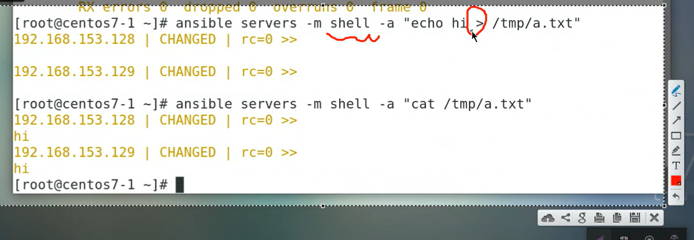
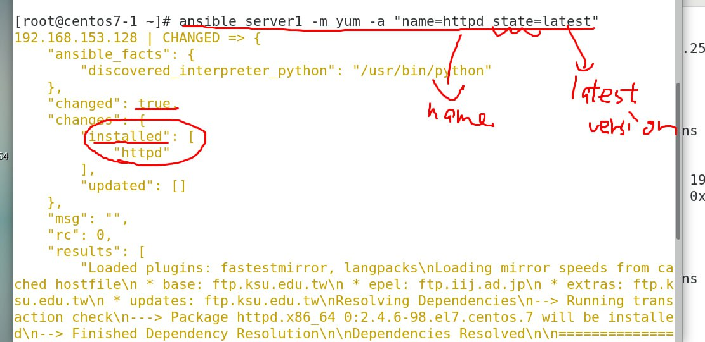
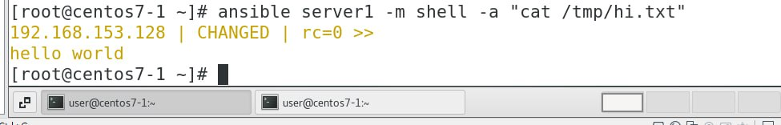
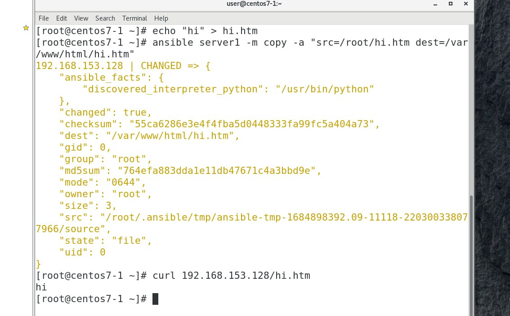
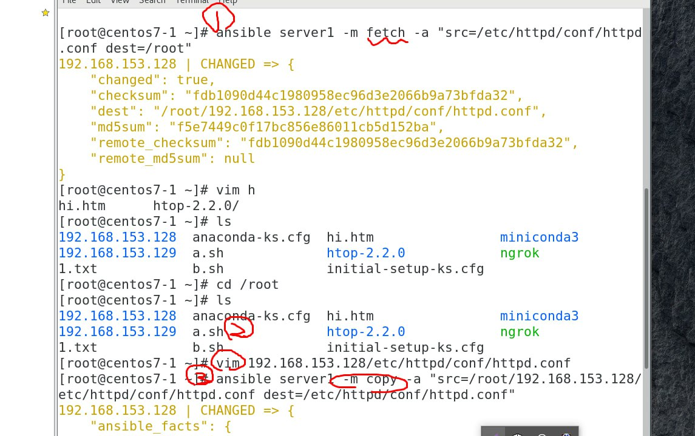

實時顯示價格
到了某個區間可以通知使用者

本平台的特點跟功能是甚麼

### 查看參數
  

為了避免一些錯誤你可以為你的虛擬機設置固定ip 不然每次開機可能ip都會換位置

既然有了 command 為甚麼要有shell?

  

匹配那行加上後面的五行

  
假如你使用 command的時候就會發生錯誤 有 `>` 就只能用shell

  
兩個指令的結果是一樣的但第一種有更多的組合

### 創建一個a.sh腳本
  

執行ansible指令可以把腳本丟到另一台或多台機器上面執行

b 腳本是獲取各主機的ip位置
  

貼一張a.sh

## yum 模組
  

  

查看特定伺服器httpd是否有被下載

  
Not change(green) 因為已經被安裝了

  

移除軟體
  

查看軟體狀態
  

貼一張安裝與移除

### copy and bath

  

  

  

  

  

貼一張fetch 後的資料夾上來

We learn: `modules: ping, command, shell, script, yum, copy, fetch`

## 更改檔案屬性
  

  

## remove file
  

## make a directory
  

  

  

  

above are directory add del modify 

## soft link
  

### 學長的筆記
> https://github.com/istar0me/linux-note/blob/107-2/Ansible.md

### 把網頁傳到別的伺服器來架設
  

  

  

  

測試成功
  

但現在是手做的，之後可以把它變成自動化

  

### Create a group

  

### Create a spefictly user attribute

  

## 移除群組使用者

  

### 移除群組
  

### 測試群組是否存在
  

### 測試使用者是否存在
  

### Linux 符號的差別
  

