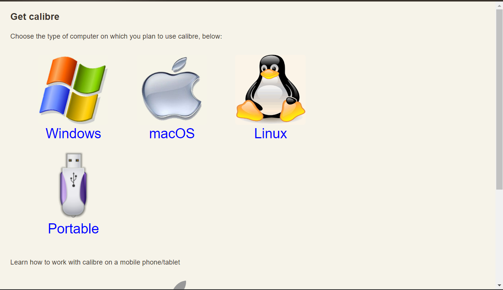
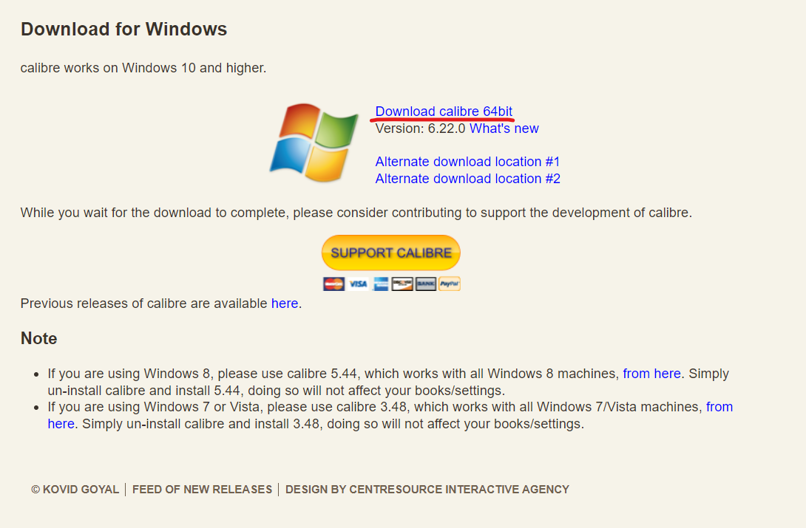

# 前言
你是否有在使用kobo的電子閱讀器產品, 但有時候搜尋到的資料卻不是kepub的後綴名?這將導致Kobo閱讀器讀取資料的數度變得緩慢，並且不能使用kobo自帶的翻譯功能?如果你有遇到以上的幾種情況，那麼我將恭喜你，你點對視頻了，在這個視頻當中，我將為您介紹一款app能夠將檔案轉換成kepub類型，那就讓我們直接開始吧~

# 安裝Calibre
我們今天要使用到的軟體就是這個Calibre，他是一款電腦端的電子書管理軟件，但我們今天只要使用他的電子書轉換成epub的功能，首先到你的瀏覽器，打上Calibre ,進入他的官方網站(https://calibre-ebook.com/),點擊Download

  

選擇你對應的作業系統
  
我這邊是選擇Windows
之後選擇  
就開始下載了
接者打開下載好的安裝檔

